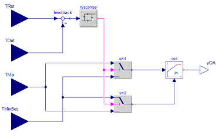

前ページ [1. はじめに](./1_GettingStarted.md)　｜　次ページ [3. エラーの回避](./3_Work-Arounds.md)  
***  
  
# 作成中[2. ベストプラクティス](http://simulationresearch.lbl.gov/modelica/userGuide/bestPractice.html)  
この章ではライブラリユーザーが新しいシステムモデルを作成する際のベストプラクティスを説明しています。ここで取り上げたトピックはModelicaをはじめて扱うユーザーによく見られる問題に基づいています。Modelicaの経験が豊富なユーザーは、この章をスキップしてよいでしょう。  
  
## 2.1. パッケージの構成  
モデルを開発するときは、Buildingsライブラリのように広く適用されるモデルを含むライブラリと、特定の建物用に作成されており他のアプリケーションでの使用が制限されるアプリケーション固有のモデルを区別する必要があります。 そしてアプリケーション固有のモデルはBuildingsライブラリの外に格納することをお勧めします。 これにより、ユーザーはアプリケーション固有のモデルを変更することなく、Buildingsライブラリを新しいバージョンに置き換えることができます。アプリケーション固有のモデルの開発中に、それが他のアプリケーションにも関係するモデルであると思った場合は、[「開発」](./5_Development.md)セクションで説明しているように、Buildingsライブラリの開発に貢献することができます。 ）。  
  
## 2.2. 大規模システムモデルの構築  
大規模なシステムモデルを作成する場合には、通常は分離してテストできるサブシステムモデルを組み合わせることでより容易にシステムモデルを構築することができます。例えば、[Buildings.Examples.ChillerPlant.BaseClasses.Controls.Examples](http://simulationresearch.lbl.gov/modelica/releases/latest/help/Buildings_Examples_ChillerPlant_BaseClasses_Controls_Examples.html) パッケージには大規模システムモデルを構成する個々のコンポーネントをテストするための小さなテストモデルが含まれています。小さなテストモデルを作成することで、制御の適切な応答とサブシステムの適切な操作を、大規模なモデルに存在する複雑なシステム相互作用から分離してテストできるため、通常は時間を節約することができます。  
  
## 2.3. パラメータと媒体パッケージの伝播  
ポンプ*pum*および質量流量センサ*sen*を備えたモデルを考えます。両方のモデルが公称質量流量のパラメータ*m_flow_nominal*を持ち、同じ値に設定する必要があると仮定します。これらのパラメータは個別に数値に設定するのではなく、モデルの最上位でのパラメータを伝播させることをお勧めします。そのため、次のような宣言の使用は推奨しません。  
```  
Pump pum(m_flow_nominal=0.1) "Pump";
TemperatureSensor sen(m_flow_nominal=0.1) "Sensor";
```  
次のような宣言を使用することを推奨します。  
```  
Modelica.SIunits.MassFlowRate m_flow_nominal = 0.1
                              "Nominal mass flow rate";
Pump pum(m_flow_nominal=m_flow_nominal) "Pump";
TemperatureSensor sen(m_flow_nominal=m_flow_nominal) "Sensor";
```  
これにより、ある場所でm_flow_nominalの値を変更した際に、その値を参照するすべてのモデルにその値を伝播させることができます。モデルの変更がより簡単でより堅牢になるので、追加の宣言のために一手間かけておくことは一般的に効果的です。  
パラメータとパッケージを伝播させることは媒体の定義にとって特に重要です。これにより、ユーザーは1つの場所で媒体宣言を変更し、それを参照するすべてのモデルに伝播させることができます。これは次のような宣言を使用して行うことができます。  
```  
replaceable package Medium = Modelica.Media.Interfaces.PartialMedium
  "Medium model for air" annotation (choicesAllMatching=true);
```  
ここで、オプションの注釈`annotation (choicesAllMatching=true) `が追加され、`Modelica.Media.Interfaces.PartialMedium`から継承するすべての媒体モデルを含むドロップダウンメニューがGUIに表示されます。  
上記のセンサが媒体モデルを必要とする可能性は高いと思われますが、その場合は次のように宣言します。  
```  
TemperatureSensor sen(redeclare package Medium = Medium,
                      m_flow_nominal=m_flow_nominal) "Sensor";
```  
システムモデルの最上位では、次のようにして`Medium`パッケージを実際の媒体に設定します。  
```
package Medium = Buildings.Media.PerfectGases.MoistAir "Medium model";
TemperatureSensor sen(redeclare package Medium = Medium,
                      m_flow_nominal=m_flow_nominal) "Sensor";
```  
  
## 2.4. 熱流体システム  
この節では熱流体システムのモデリングに特有なベストプラクティスについて説明します。  
  
### 2.4.1. 過剰な初期化条件指定と矛盾した方程式  
ここでは温度や圧力などの状態変数を初期化する方法について説明します。  
下の図のように直列に接続された質量流量ソース*Models.Fluid.Sources.MassFlowSource_T*、流体ボリューム*Buildings.Fluid.MixingVolumes.MixingVolume*と固定境界条件*Buildings.Fluid.Sources.FassedBoundary*からなるモデルを考えます。インスタンス*bou*がポートで媒体の圧力を設定する式を実装していること、すなわち圧力ポート*bou.ports.p*は固定されてることに注意してください。  
  
  
図2.1 質量流量ソース、流体ボリューム、圧力ソースの概略図  

このボリュームでは4つの異なる方法でエネルギーと質量のバランス方程式を設定できます。ボリュームの圧力p(⋅) 、初期圧力のパラメータp0、ボリュームに含まれる質量m(⋅) 、ボリュームのi番目の流体ポートの質量流量m˙i(⋅)、流体ポートの数N∈N  、初期の時間t0  を設定します。それから、流体容積の質量バランスの式を以下の表に示すように設定することができます。

|Parameter<br>massDynamics|Initialization problem<br>if ρ=ρ(p)|Initialization problem<br>if if ρ≠ρ(p)|Equation used during time stepping<br>|
|:--|:--|:--|:--|
|DynamicsFreeInitial|Unspecified|Unspecified|dm(t)/dt=∑Ni=1m˙i(t)|
|FixedInitial|p(t0)=p0|Unspecified|dm(t)/dt=∑Ni=1m˙i(t)|
|SteadyStateInitial|dp(t0)/dt=0|Unspecified|dm(t)/dt=∑Ni=1m˙i(t)|
|SteadyState|Unspecified|Unspecified|0=∑Ni=1m˙i(t)|  
  
*Unspecified*は、初期値に対して式が宣言されていないことを意味します。この状況は2つの場合があります。  
1. 上記モデルにおいてモデルが接続するためにシステムモデルで圧力を*vol.p=vol.ports.p= bou.ports.p*と設定した場合、そのボリュームの圧力 p(t0)は*bou.ports.p*に等しくなります。  
2. システムモデルで圧力を設定しない場合（つまり、*vol*と*bou*が互いに接続されていない場合）、圧力は値`p(start=Medium.p_default)`から開始します。ここで*Medium*は媒体モデルの名前を示しています。  
  
*Buildings.Fluid.Sources.FixedBoundary*モデルはポートの圧力を固定しているため、初期状態p(t0)=p0とdp(t0)/dt=0では上に示したモデルにとって過剰に条件指定したシステムになります。このような状況を回避するには、異なる初期条件を使用するか混合容積と圧力ソールの間に流動抵抗を追加します。流動抵抗は、混合容積と圧力ソースの圧力を質量流量の関数として関連づける式を導入し、それにより不一致を取り除きます。  
  
|警告|
|:--|
|*FixedInitial*設定は注意して使用しなければなりません。圧力ダイナミクスが速いため、この設定によりシミュレーションの開始時に非常に高速な過渡状態にが引き起こされます。このような過渡現象は微分方程式ソルバーの数値問題を引き起こす可能性があります。|
  
同様にエネルギー収支については、ボリュームが貯蔵するエネルギー、ボリュームの温度、ボリュームのi番目の流体コネクタを通過する単位質量あたりの比エンタルピーを運ぶ質量流量、ボリュームの熱ポートでの熱流を設定します。  
そして、エネルギーバランスの式は次の表に示すように設定できます。  
  
|Parameter,energyDynamics|Initialization problem|Equation used during time stepping|
|:--|:--|:--|
|DynamicsFreeInitial|Unspecified|dU(t)/dt=∑Ni=1m˙i(t)hi(t)+Q˙(t)|
|FixedInitial|T(t0)=T0|dU(t)/dt=∑Ni=1m˙i(t)hi(t)+Q˙(t)|
|SteadyStateInitial|dT(t0)/dt=0|dU(t)/dt=∑Ni=1m˙i(t)hi(t)+Q˙(t)|
|SteadyState|Unspecified|0=∑Ni=1m˙i(t)hi(t)+Q˙(t)|  
  
*Unspecified*は、 T(t0)について式が宣言されていないことを意味します。この状況は2つの場合があります。
1. システムモデルで温度を設定する場合（すなわち、モデル内で*vol*の熱ポートが固定温度に接続されている場合）、そのボリュームのT(t0)はこのポートに接続された温度に等しくなります。
2. システムモデルで温度を設定しない場合、温度は`T(start=Medium.T_default)`から開始します。ここで、*Medium*は媒体モデルです。

|注意|
|:--|
|1. エネルギーバランスに対して*SteadyState*を選択して質量バランスに対して*SteadyState*を選択しないことは矛盾した方程式につながる可能性があります。モデルはこの状況をチェックし、エラーメッセージを出力してで変換を停止します。方程式が矛盾する理由を調べるには、2つの流体ポートを持ち、熱ポートを持たないボリュームを考えます。dm(t)/dt=m˙1(t)+m˙2(t)であるため、m˙1(t)≠0 かつm˙2(t)=0となる可能性があります。しかし、エネルギーバランスの式は熱ポートがないため、 Q˙(t)=0として0=∑2i=1m˙i(t)hi(t)+Q˙(t) となります。したがって0=m˙1(t)h1(t)となり矛盾してしまいます。<br>2. 圧力初期化の場合とは異なり、モデルbouの温度は初期の時点で`vol.T=bou.T`にはなりません。これは、物理的に*bou*と*vol*の温度が異なってもよいためです。|  
  
質量分率のダイナミクス（水蒸気濃度など）と微量物質のダイナミクス（二酸化炭素濃度など）の式は、エネルギー方程式に類似しています。  
ボリュームの中の物質の質量X(⋅)、ボリュームの初期質量m(t0) 、ボリュームの中の選択した物質の濃度x0、i番目の流体ポートの物質の濃度xi(⋅) 、外部から加えられた物質X˙(⋅) （例えば、加湿器によって加えられた水蒸気）を設定します。そして、物質のダイナミクスは次の表に示すように設定できます。  
|Parameter,massDynamics|Initialization|problem Equation used during time stepping|
|:--|:--|:--|
|DynamicsFreeInitial|Unspecified|dX(t)/dt=∑Ni=1m˙i(t)xi(t)+X˙(t)|
|FixedInitial|X(t0)=m(t0)x0|dX(t)/dt=∑Ni=1m˙i(t)xi(t)+X˙(t)|
|SteadyStateInitial|dX(t0)/dt=0|dX(t)/dt=∑Ni=1m˙i(t)xi(t)+X˙(t)|
|SteadyState|Unspecified|0=∑Ni=1m˙i(t)xi(t)+X˙(t)|
  
微量物質のダイナミクスの式はその物質のダイナミクスの式と同一であり、X(⋅),X˙(⋅)  xi(⋅)をC(⋅),C˙(⋅) and ci(⋅)で置き換えるとき、C(⋅)はボリューム中の微量物質、ci(⋅)はi番目の流体ポートにおける微量物質濃度、C˙(⋅)は外部から加えられる微量物質の質量流量となります。微量物質動力学のしたがって、エネルギー、質量分率および微量物質は、同一の方程式および構成を有する。  
  
### 2.4.2. 流体の接合部のモデリング  
Modelicaでは、以下に示すように流体ポートを接続することで接合部で理想的な混合が行われます。下記のような状況では、複数のコネクタを流体ポートに接続することは、モデル化しようとしている物理現象を表しています。  
  
  
図2.2 合流または分岐モデルを明示的に導入しない3つのコンポーネントの接続  
  
しかし、より複雑なフロー構成では配管ネットワークやダクトネットワークのどの分岐が合流するかを明示的に制御したい場合があります。これは、下の左の図（テストモデル[BoilerPolynomialClosedLoop](http://simulationresearch.lbl.gov/modelica/releases/latest/help/Buildings_Fluid_Boilers_Examples.html#Buildings.Fluid.Boilers.Examples.BoilerPolynomialClosedLoop)の一部）に示すようにモデル[PressureDrop](http://simulationresearch.lbl.gov/modelica/releases/latest/help/Buildings_Fluid_FixedResistances.html#Buildings.Fluid.FixedResistances.PressureDrop)のインスタンスを使用することで実現できます。
  
  
図2.3 合流または分岐モデルを使用したコンポーネントの正しい接続（左）と間違った接続（右）  
  
左の図では、混合点が流れを混合または分割する三方向モデルの使用によって正しく定義されています。合流または分岐モデルの公称圧力降下をゼロに設定することで、流れ抵抗の式は導入されないように合流または分岐モデルを単純化することできます。さらに、バルブに接続する分岐部では圧力降下をモデル化することができ、それがバルブオーソリティに影響を与えます。しかし右の図では、ポートAから出る流れはポートBでの流れとボリューム*vol*からの戻る流れと合流し、ポートCに流れます。したがって、バルブに誤った温度が与えられることになります。

### 2.4.3. 流体フローシステムでのセンサーの使用  
センサーモデルを選択する場合、測定量が流れの方向に依存するかどうかを区別する必要があります。測定量が温度や相対湿度などのように流れ方向に依存する場合は、[Buildings.Fluid.Sensors](http://simulationresearch.lbl.gov/modelica/releases/latest/help/Buildings_Fluid_Sensors.html#Buildings.Fluid.Sensors)ライブラリの2つのポートを持つセンサーを使用する必要があります。これらのセンサは流れがその方向を逆転させる状況に対して1つのポートを有するセンサよりも効率的な実装となっています。適切な使用センサーについては、[Buildings.Fluid.Sensors](http://simulationresearch.lbl.gov/modelica/releases/latest/help/Buildings_Fluid_Sensors.html#Buildings.Fluid.Sensors)パッケージの[「ユーザーガイド」](http://simulationresearch.lbl.gov/modelica/releases/latest/help/Buildings_Fluid_Sensors_UsersGuide.html)に記載されています。  
  
### 2.4.4. 水等の非圧縮性流体の基準圧力  
この節では非圧縮性流体の基準圧力を設定する方法について説明します。温度の関数として密度をモデル化する流体の場合には、流体の熱膨張をどのように考慮するかについても示しています。  
以下に示すポンプまたはファン、流動抵抗およびボリュームからなる流れ回路を考えます。  
  
  
図2.4 基準圧力を設定する方法や流体の熱膨張を考慮する方法がない流れ回路の概略図

このモデルが媒体モデル[Buildings.Media.Air](http://simulationresearch.lbl.gov/modelica/releases/latest/help/Buildings_Media_Air.html#Buildings.Media.Air)のような[圧縮性流れ](./7_Glossary.md)をモデル化する媒体モデルと共に使用されるとき、気体媒体が*p=ρRT*の式を実装しているので明確に定義されているといえます。ここで*p*は静圧、*ρ*は質量密度、*R*は気体定数、*T*は絶対温度を示します。  
しかし、媒体モデルが[Buildings.Media.Water](http://simulationresearch.lbl.gov/modelica/releases/latest/help/Buildings_Media_Water.html#Buildings.Media.Water)などの[非圧縮性流れ](./7_Glossary.md)をモデル化するモデルに変更された場合は密度は一定となります。したがって、体積から圧力を計算するために使用できる方程式がなくなってしまいます。この状況でモデルを変換しようとすると、Dymolaで次のエラーメッセージが表示されます。  
```  
The DAE has 151 scalar unknowns and 151 scalar equations.
Error: The model FlowCircuit is structurally singular.
The problem is structurally singular for the element type Real.
The number of scalar Real unknown elements are 58.
The number of scalar Real equation elements are 58.
```  
同様に、圧力とエンタルピーの関数として密度をモデル化する媒体モデル[Buildings.Media.Specialized.Water.TemperatureDependentDensity](http://simulationresearch.lbl.gov/modelica/releases/latest/help/Buildings_Media_Specialized_Water_TemperatureDependentDensity.html#Buildings.Media.Specialized.Water.TemperatureDependentDensity)を使用する場合はモデルは明確に定義されていますが、圧力はポンプが稼動する時間が長くなるほど大きくなります。これはポンプが水に熱を加えているためです。水温が*20℃*から*40℃*に上昇すると、圧力は*1bars*から*150bar*に増加します。  
この特異性や圧力上昇を避けるには、圧力ソースを与えて流体の膨張を考慮するモデルを使用します。例えば、[Buildings.Fluid.Storage.ExpansionVessel](http://simulationresearch.lbl.gov/modelica/releases/latest/help/Buildings_Fluid_Storage.html#Buildings.Fluid.Storage.ExpansionVessel)を使用して、以下に示すシステムモデルを作成します。  
  
  
図2.5 圧力ソースを追加し媒体の熱膨張を考慮する膨張タンクを備えた流れ回路の概略図  
  
別の方法として[Buildings.Fluid.Sources.FixedBoundary](http://simulationresearch.lbl.gov/modelica/releases/latest/help/Buildings_Fluid_Sources.html#Buildings.Fluid.Sources.FixedBoundary)を使用することもできます。これは圧力を一定値に設定し、圧力を維持するために必要に応じて流体を追加または削除します。 [Buildings.Fluid.Sources.FixedBoundary](http://simulationresearch.lbl.gov/modelica/releases/latest/help/Buildings_Fluid_Sources.html#Buildings.Fluid.Sources.FixedBoundary)モデルを使うと一般的に[Buildings.Fluid.Storage.ExpansionVessel](http://simulationresearch.lbl.gov/modelica/releases/latest/help/Buildings_Fluid_Storage.html#Buildings.Fluid.Storage.ExpansionVessel)より簡単な方程式になります。  [Buildings.Fluid.Sources.FixedBoundary](http://simulationresearch.lbl.gov/modelica/releases/latest/help/Buildings_Fluid_Sources.html#Buildings.Fluid.Sources.FixedBoundary)の流体ポートから流出する媒体は固定温度ですが、[Buildings.Fluid.Storage.ExpansionVessel](http://simulationresearch.lbl.gov/modelica/releases/latest/help/Buildings_Fluid_Storage.html#Buildings.Fluid.Storage.ExpansionVessel)モデルはエネルギーを保存します。しかし、流体の熱膨張は通常小さいので、この影響はほとんどの建物のHVAC用途では無視することができます。  
  
  
図2.6 固定圧力ソースを追加し媒体の熱膨張を考慮する境界モデルを備えた流れ回路の概略図  
  
|注意|
|:--|
|それぞれの水回路には、[Buildings.Fluid.Storage.ExpansionVessel](http://simulationresearch.lbl.gov/modelica/releases/latest/help/Buildings_Fluid_Storage.html#Buildings.Fluid.Storage.ExpansionVessel)インスタンスか[Buildings.Fluid.Sources.FixedBoundary](http://simulationresearch.lbl.gov/modelica/releases/latest/help/Buildings_Fluid_Sources.html#Buildings.Fluid.Sources.FixedBoundary)インスタンスが1つだけ存在する必要があります。このようなデバイスがない場合は絶対圧力が定義されないか、そうでなければ媒体密度が変化する場合には非現実的な大きな値に上昇するかもしれません。デバイスが複数ある場合はシステムに基準静圧を設定する複数のポイントがあることになります。これは質量流量の分布に影響を与えます|  
  
### 2.4.5. 公称値  
ほとんどのコンポーネントには公称動作条件のパラメータがあります。これらのパラメータは*_nominal*で終わる名前を持ち、全負荷または設計条件で動作する場合にコンポーネントが通常持つことになる値を設定する必要があります。モデルによってはこれらのパラメータが異なって使用されるので、それぞれのモデルのドキュメントやコードを参照して詳細を確認する必要があります。ただし、以下の表はさまざまなモデルの典型的なパラメータの使用法を理解するのに役立ちます。  
  
|パラメータ|モデル|説明|
|:--|:--|:--|
|*m_flow_nominal*<br>*dp_nominal*|流動抵抗モデル|これらのパラメータを使用してP-Q曲線上の点を定義することができます。他の質量流量については、圧力降下は一般的に相似法則を用いて調整されます。 [PressureDrop](http://simulationresearch.lbl.gov/modelica/releases/latest/help/Buildings_Fluid_FixedResistances.html#Buildings.Fluid.FixedResistances.PressureDrop)を参照してください。|
|*m_flow_nominal*<br>*m_flow_small*|センサー<br>ボリューム<br>熱交換器|これらのモデルの中には、デフォルト値として`m_flow_small=1E-4*abs(m_flow_nominal)`を設定するものがあります。そして*m_flow_small*は、質量流量が*m_flow_small*より小さい場合に方程式を正則化したり置き換えたりするために使用されます。この操作はモデルの数値的性質を改善するために必要となります。設計流量から0.01％以下の流量ではほとんどのモデルの仮定は適用されず、HVACシステムはこの領域では動作しないため、結果の誤差は一般的なアプリケーションでは無視できます。 Modelicaは連続時間領域でシミュレートするのでこのような小さな流量が発生する可能性があり、モデルをゼロまたはほぼゼロの流量で数値的に適切に動作するように実装します。|
|*tau*<br>*m_flow_nominal*|センサー<br>ボリューム<br>熱交換器<br>チラー|Modelicaは連続時間領域でシミュレーションするため、動的モデルは一般に定常状態モデルよりも数値的に効率的となります。しかし、動的モデルは一般に製造業者によって公表されていない製品データを必要とします。例としては装置に含まれる流体の量や熱交換器の重量などがあります。さらに、チラーの配管や熱交換器の輸送遅延などの他の影響は一般には知られておらず、設計段階では一般的に利用できない詳細な形状が必要です。<br>この問題を回避するために、多くのモデルがパラメータとして時定数*tau*をとり、その熱的なまとまりをすべて流体ボリュームに集中させます。時定数*tau*は、ステップ変化の入力を与えたときにコンポーネントの質量流量が*m_flow_nominal*に等しくなる場合に観測できる時定数として理解することができます。これらの2つの値と流体密度*rho*を使用して、ボリュームに特定の時間応答を与えるためにコンポーネントのボリュームを`V=m_flow_nominal tau/rho`のように調整します。ほとんどのコンポーネントでは、エンジニアリングの経験を使って*tau*の妥当な値を見積もることができ、一般的に適用可能な値を使用できる場合にはデフォルト値としてすでに設定してあります。コンポーネントはすでにタウのデフォルト値を設定しています。例としては[WetCoilDiscretized](http://simulationresearch.lbl.gov/modelica/releases/latest/help/Buildings_Fluid_HeatExchangers.html#Buildings.Fluid.HeatExchangers.WetCoilDiscretized)を参照してください。|  
  
## 2.5. 反復変数の初期値  
非線形方程式系の数値解法では一般にニュートン法ベースのソルバーが使用されます。このようなソルバーは、反復変数に良好な初期値が与えられればより良好に収束する可能性が高くなります。 Dymolaではどのような初期値が使用されているかを確認するために、シミュレーションタブに次のようなコマンドを入力します。  
```  
Advanced.LogStartValuesForIterationVariables = true;
```  
Then, when a model is translated, for example using
そして例えば次のようにモデルを変換するときに、  
```  
translateModel("Buildings.Fluid.Boilers.Examples.BoilerPolynomialClosedLoop");
```  
次のような形式で出力されます。  
```  
Start values for iteration variables:
 val.res1.dp(start = 3000.0)
 val.res3.dp(start = 3000.0)
```  
ここで反復変数とその初期値が表示されます。初期値はモデル上で上書きすることができます。  
  
## 2.6. イベントの回避
Modelicaでは、Real型の変数*x*と*y*において*x>y*などのReal型要素の演算で値が変わるときにいつも時間積分が停止します。この状況ではイベントが発生しており、その関係式が値を変更する間はソルバーが時間間隔を小さくしています。この時間間隔の選定は、反復計算が大きな方程式系の評価を必要とする場合に計算時間を大幅に増加させる可能性があります。このようなイベントが発生する例としては次のような関係のときがあります。  
```  
if port_a.m_flow > 0 then
  T_in = port_a.T;
else
  T_in = port_b.T;
end if;
```  
すなわち次のようなときです。  
```  
T_in = if port_a.m_flow > 0 then port_a.T else port_b.T;
```  
そのようなコードを含むモデルをシミュレートする場合、時間積分では*port_a.m_flow*がゼロと交差する時刻を見つけるために反復計算をします。モデルを仮定することによって*port_a.m_flow=0*付近の近似式を作成できる場合、関係式(比較演算式)をイベントの反復を必要としない近似式で置き換えることで計算時間を短縮できます。
例えば、上記の式は次のように近似できます。
```  
T = Modelica.Fluid.Utilities.regStep(
  port_a.m_flow, T_a_inflow, T_b_inflow,
  m_flow_nominal*1E-4);
```  
ここで、*m_flow_nominal*は全負荷時のモデルの質量流量近傍に設定されたパラメータです。流量の大きさが典型的な流量の1E-4倍より大きい場合は近似式は正確な式と同じであり、その値より下では近似式が使用されます。しかしながら、このような小さな流速では多くのエネルギーは輸送されないため、近似によってもたらされる誤差は一般に無視できます。  
場合によってはモデルにダイナミクスを追加すると計算時間がさらに向上する場合があります。例えば[数値ノイズ](./7_Glossary.md)により引数*port_a.m_flow*が*+/- 1E-4\*m_flow_nominal*の範囲で振動したときに[Modelica.Fluid.Utilities.regStep](http://simulationresearch.lbl.gov/modelica/releases/msl/3.2)の戻り値が急激に変化する可能性があるためです。次のような定式化によりダイナミクスを加えることができます。  
```  
TMed = Modelica.Fluid.Utilities.regStep(
  port_a.m_flow, T_a_inflow, T_b_inflow,
  m_flow_nominal*1E-4);
der(T)=(TMed-T)/tau;
```  
ここで、*tau>0*は時定数とします。堅牢な実装の例としては[Buildings.Fluid.Sensors.TemperatureTwoPort](http://simulationresearch.lbl.gov/modelica/releases/latest/help/Buildings_Fluid_Sensors.html#Buildings.Fluid.Sensors.TemperatureTwoPort)を参照してください。  
  
|注意|
|:--|
|[Buildings.Utilities.Math](http://simulationresearch.lbl.gov/modelica/releases/latest/help/Buildings_Utilities_Math.html#Buildings.Utilities.Math)パッケージでは、
イベントを避けるために*smooth*で始まる名前の関数やブロックを使用します。|  

## 2.7. 制御  
  
図2.7 コイルのオン/オフを切り替えるコントローラの概略図(上の構成では制御入力が設定値の近くにある場合、ヒステリシスにより数値問題（とショートサイクリング）が回避されます。下の構成ではしきい値ブロックへの入力信号が反復ソルバの解で293.15ケルビンの近傍である場合、積分を停止することがあります。)  
  
オン/オフコントローラを実装する場合は、上図の上の構成で示したようなヒステリシスを持つコントローラを必ず使用してください。ヒステリシスが使用されなければ、コントローラに入力される変数が反復アルゴリズムで計算される変数に依存する場合に数値的な問題が発生する可能性があります。反復アルゴリズムの例としては、非線形方程式ソルバや、可変ステップサイズの時間積分アルゴリズム（Dymolaのradauとdasslソルバーなど）があります。この問題は、次のようにして発生します。例えば、*T(t)∈R*が室内空気温度などのコントローラへの入力とします。*T(t)*が微分方程式から計算された状態変数である場合、または*T(t)*が反復的に解く必要のある変数に依存する場合、ϵをソルバーの許容残差としたとき、*T(t)*は近似値*T\*(ϵ,t)*によって近似することしかできません。たとえシステムが平衡状態であっても、ソルバーは*T\*(ϵ,t)*の値を反復ごとにわずかに変化させることができます。したがって、*T\*(ϵ,t)*はいわゆる数値ノイズを発する可能性があります。そして、*T\*(ϵ,t)*が設定点温度で交差するたびにヒーターのオン/オフを切り替えており、*T(t)*が設定点温度付近で平衡状態にある場合、ヒーターは数値ノイズによってオンとオフを急速に切り替える可能性があります。これは時間積分を停止させる原因となります。  
  
この問題を説明するため、次のようにシミュレートをしてみてください。  
```  
model Unstable
  Real x(start=0.1);
equation
  der(x) = if x > 0 then -1 else 1;
end Unstable;
```  
Dymola 2013では、`if-then-else`構文は*x*がゼロを交差するたびにイベントの繰り返しを引き起こすため、*t=0.1*のときに予測した通りにモデルが停止します。  
  
|警告|
|:--|
|不等式比較で使用する変数が次の条件に当てはまる場合は、決してヒステリシスや時間遅延なしの不等式比較を使用しないでください。<br>・[反復ソルバー](7_Glossary.md)を使用して計算されている。<br>・測定値から得られており測定ノイズを含んでいる可能性がある。<br>このようなテストで発生し得る遅いシミュレーションをデバッグし、修正する方法については次節の例を参照してください。|  
  
## 2.8. 遅いシミュレーションのデバッグと修正の例  
### 2.8.1. 状態イベント  
この節ではイベントによって停止したシミュレーションをデバッグして原因を突き止めて修正する方法を示します。詳細はツールごとに異なるかもしれませんが、原理は同じものです。私たちの環境では、Buildingsライブラリバージョン3.0.0のモデルを使用してDymola 2016 FD01でBuildings.Examples.DualFanDualDuctを1年間シミュレートしようとしました。私たちは以下のように実行しました。  
```  
simulateModel("Buildings.Examples.DualFanDualDuct.ClosedLoop",
               stopTime=31536000, method="radau",
               tolerance=1e-06, resultFile="DualFanDualDuctClosedLoop");
```  
そして計算時間とイベントの数をプロットしました。*t=0.95e7*秒付近において下の図に示すようなスパイクがありました。  
  
  
図2.8 計算時間とイベントの数  
  
イベントの数が大幅に増加したので、Dymolaで*Simulation->Setup*の*Debug*タブの*Events during simulation*エントリを有効にし、モデルを*t=0.9e7秒から*t=1.0e7*秒までシミュレートしました。そして開始時間を*t=0.9e7*秒に設定すると動作を再現するのに十分であることが判明しました。そうでなければそれ以前の時間に設定する必要がありました。シミュレーションが停止してDymolaのログファイル*dslog.txt*を調べると、最後のエントリが以下のようになっていました。  
```  
Expression TRet.T > amb.x_pTphi.T became true ( (TRet.T)-(amb.x_pTphi.T) = 2.9441e-08 )
Iterating to find consistent restart conditions.
      during event at Time :  9267949.854873843
Expression TRet.T > amb.x_pTphi.T became false ( (TRet.T)-(amb.x_pTphi.T) = -2.94411e-08 )
Iterating to find consistent restart conditions.
      during event at Time :  9267949.855016639
Expression TRet.T > amb.x_pTphi.T became true ( (TRet.T)-(amb.x_pTphi.T) = 2.94407e-08 )
Iterating to find consistent restart conditions.
      during event at Time :  9267949.855208419
Expression TRet.T > amb.x_pTphi.T became false ( (TRet.T)-(amb.x_pTphi.T) = -2.94406e-08 )
Iterating to find consistent restart conditions.
      during event at Time :  9267949.855351238
```  
数ミリ秒ごとにイベントが発生しているため、シミュレーションが進捗していないように見えています。 ソルバーは適切な処理を行い、積分を停止し、イベントを処理し、積分を再開し、数ミリ秒後に別のイベントが発生しているだけなのです。そのため、私たちはシステムモデルに戻って、戻り空気温度センサ*TRet.T*の出力信号を調べることにしました。このことは、戻り空気温度センサの*TRet.T*の出力信号が制御ゲインの符号を切り替えるためにエコノマイザ制御で使用されていることを示します。なぜなら、エコノマイザは雰囲気温度と戻り空気温度に応じて加熱や冷却をしているからです。問題のあるモデルを下の図に示します。  
  
  
図2.9 外気ダンパ制御信号を計算するエコノマイザ制御の一部のブロック図（この実装は多くのイベントを発生させます）  
  
イベントは制御を変更する不等式ブロックによって引き起こされています。これにより今度は戻り空気温度がわずかに変化しています。これはおそらく[数値ノイズ](./7_Glossary.md)によるものか、ダンパーが調整されるときにレタンファンが動作点を変えて媒体に加えられる熱が変わる事によるものと考えられます。とにかく、これはセンサ信号に測定ノイズがあると実際のシステムで振動現象を引き起こすという悪い実装になっています。したがって、この不等式ブロックはヒステリシスを持つブロックに置き換えなければなりません。これを下の図に示すように行いました。私たちは0.2ケルビンのヒステリシスを選択しています。今ではモデルは一年を通してうまく動作します。  
  
  
図2.10 外気ダンパ制御信号を計算するエコノマイザ制御の改訂版の一部のブロック図  
  
### 2.8.2. エラー制御を支配する状態変数  
`Buildings.Examples.DualFanDualDuct.ClosedLoop`というモデルの開発版(commit [ef410ee](https://github.com/lbl-srg/modelicabuildings/commit/ef410ee8a5d1816f8b8e171da7743e15caaa3163),では、図2.11に示すようにシミュレーションの一部でシミュレーション時間が非常に遅くなっていました。  
  
  
図2.11 計算時間とイベントの数  
  
状態イベントの数はその時間間隔では増加しませんでした。問題を特定するために、Dymolaの`Simulation->Setup`で、どの状態がエラーを支配するかを記録するオプションを有効にしました（デバッグタブを参照）。  
再度シミュレーションを実行すると、次の出力が得られました。  
```  
Integration terminated successfully at T = 1.66e+07
  Limit stepsize, Dominate error, Exceeds 10% of error Component (#number)
      0     1     6 cooCoi.temSen_1.T (#  1)
     36     0   140 cooCoi.temSen_2.T (#  2)
     37     0     0 cooCoi.ele[1].mas.T (#  3)
     45     0     0 cooCoi.ele[2].mas.T (#  4)
     51     0     0 cooCoi.ele[3].mas.T (#  5)
     53     0     0 cooCoi.ele[4].mas.T (#  6)
  13555 13201 19064 fanSupHot.filter.x[1] (#  7)
  11905  2170 12394 fanSupHot.filter.x[2] (#  8)
    400    47   419 fanSupCol.filter.x[1] (#  9)
    420    71   521 fanSupCol.filter.x[2] (# 10)
   5082  2736  6732 fanRet.filter.x[1] (# 11)
   1979    25  4974 fanRet.filter.x[2] (# 12)
     38     0     3 TPreHeaCoi.T (# 13)
     30     0     1 TRet.T (# 14)
     38     0     3 TMix.T (# 15)
     80     0     0 TCoiCoo.T (# 16)
    305    22   275 cor.vavHot.filter.x[1] (# 18)
```  
これにより、以下の状態変数がステップサイズを他の変数よりも大幅に制限していることがわかります。  
```  
13555 13201 19064 fanSupHot.filter.x[1] (#  7)
11905  2170 12394 fanSupHot.filter.x[2] (#  8)
  400    47   419 fanSupCol.filter.x[1] (#  9)
  420    71   521 fanSupCol.filter.x[2] (# 10)
 5082  2736  6732 fanRet.filter.x[1] (# 11)
 1979    25  4974 fanRet.filter.x[2] (# 12)
```  
したがって、ファンモデルにおいて`filteredFeed=false`とパラメータを設定してこれらの状態変数を削除しました。この変更後、問題なくこのモデルでシミュレーションをしています。  
  
## 2.9. 数値ソルバー
Dymola 2017は、デフォルトソルバーとして許容誤差1E-4でdasslを使用するように設定されています。この設定を約1E-6程度の許容誤差でradauに変更することを推奨します。これは一般に、熱流体フローシステムのシミュレーションがより速くより堅牢になるためです。  
また、ここでの許容誤差はローカル積分時間ステップの許容誤差であることに注意してください。ほとんどの常微分方程式ソルバーは、ローカル積分誤差のみを制御し、グローバル積分誤差は制御しません。経験則として、グローバル積分誤差はローカル積分誤差より1桁大きくなります。しかし、グローバル積分誤差の実際の大きさは、微分方程式の安定性に依存しています。極端なケースとして、システムが混沌として制御不能な場合、グローバル積分誤差は急速に大きくなります。  
  
***  
前ページ [1. はじめに](./1_GettingStarted.md)　｜　次ページ [3. エラーの回避](./3_Work-Arounds.md)