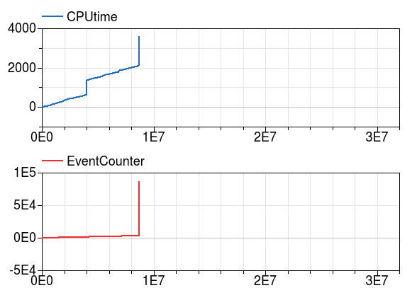

前ページ [1. はじめに Getting Started](./1_GettingStarted.md)　｜　次ページ [3. エラー防止 Work-Arounds](./3_Work-Arounds.md)  
  
# 作成中[2. ベストプラクティス Best Practice](http://simulationresearch.lbl.gov/modelica/userGuide/bestPractice.html)  
この章ではライブラリユーザーが新しいシステムモデルを作成する際のベストプラクティスを説明しています。ここで取り上げたトピックはModelicaをはじめて扱うユーザーによく見られる問題に基づいています。Modelicaの経験が豊富なユーザーは、この章をスキップしてよいでしょう。  
  
## 2.1. パッケージの構成  
モデルを開発するときは、Buildingsライブラリのように広く適用されるモデルを含むライブラリと、特定の建物用に作成されており他のアプリケーションでの使用が制限されるアプリケーション固有のモデルを区別する必要があります。 そしてアプリケーション固有のモデルはBuildingsライブラリの外に格納することをお勧めします。 これにより、ユーザーはアプリケーション固有のモデルを変更することなく、Buildingsライブラリを新しいバージョンに置き換えることができます。アプリケーション固有のモデルの開発中に、それが他のアプリケーションにも関係するモデルであると思った場合は、[「開発」](./5_Development.md)セクションで説明しているように、Buildingsライブラリの開発に貢献することができます。 ）。  
  
## 2.2. 大規模システムモデルの構築  
大規模なシステムモデルを作成する場合には、通常は分離してテストできるサブシステムモデルを組み合わせることでより容易にシステムモデルを構築することができます。例えば、[Buildings.Examples.ChillerPlant.BaseClasses.Controls.Examples](http://simulationresearch.lbl.gov/modelica/releases/latest/help/Buildings_Examples_ChillerPlant_BaseClasses_Controls_Examples.html) パッケージには大規模システムモデルを構成する個々のコンポーネントをテストするための小さなテストモデルが含まれています。小さなテストモデルを作成することで、制御の適切な応答とサブシステムの適切な操作を、大規模なモデルに存在する複雑なシステム相互作用から分離してテストできるため、通常は時間を節約することができます。  
  
## 2.3. パラメータとメディアパッケージの伝達  
ポンプ*pum*および質量流量センサ*sen*を備えたモデルを考えます。両方のモデルが公称質量流量のパラメータ*m_flow_nominal*を持ち、同じ値に設定する必要があると仮定します。これらのパラメータは個別に数値に設定するのではなく、モデルの最上位でのパラメータを伝播させることをお勧めします。そのため、次のような宣言の使用は推奨しません。  
```  
Pump pum(m_flow_nominal=0.1) "Pump";
TemperatureSensor sen(m_flow_nominal=0.1) "Sensor";
```  
次のような宣言を使用することを推奨します。  
```  
Modelica.SIunits.MassFlowRate m_flow_nominal = 0.1
                              "Nominal mass flow rate";
Pump pum(m_flow_nominal=m_flow_nominal) "Pump";
TemperatureSensor sen(m_flow_nominal=m_flow_nominal) "Sensor";
```  
これにより、ある場所でm_flow_nominalの値を変更した際に、その値を参照するすべてのモデルにその値を伝播させることができます。モデルの変更がより簡単でより堅牢になるので、追加の宣言のために一手間かけておくことは一般的に効果的です。  
パラメータとパッケージを伝播させることは媒体の定義にとって特に重要です。これにより、ユーザーは1つの場所で媒体宣言を変更し、それを参照するすべてのモデルに伝播させることができます。これは次のような宣言を使用して行うことができます。  
```  
replaceable package Medium = Modelica.Media.Interfaces.PartialMedium
  "Medium model for air" annotation (choicesAllMatching=true);
```  
ここで、オプションの注釈`annotation (choicesAllMatching=true) `が追加され、`Modelica.Media.Interfaces.PartialMedium`から継承するすべての媒体モデルを含むドロップダウンメニューがGUIに表示されます。  
上記のセンサが媒体モデルを必要とする可能性は高いと思われますが、その場合は次のように宣言します。  
```  
TemperatureSensor sen(redeclare package Medium = Medium,
                      m_flow_nominal=m_flow_nominal) "Sensor";
```  
システムモデルの最上位では、次のようにして`Medium`パッケージを実際の媒体に設定します。  
```
package Medium = Buildings.Media.PerfectGases.MoistAir "Medium model";
TemperatureSensor sen(redeclare package Medium = Medium,
                      m_flow_nominal=m_flow_nominal) "Sensor";
```  
  
## 2.4. 熱流体システム  
この節では熱流体システムのモデリングに特有なベストプラクティスについて説明します。  
  
### 2.4.1. 過度の初期化問題と一貫性のない方程式Overdetermined initialization problem and inconsistent equations  
ここでは温度や圧力などの状態変数を初期化する方法について説明します。
下の図のように直列に接続された質量流量ソース*Models.Fluid.Sources.MassFlowSource_T*、流体ボリューム*Buildings.Fluid.MixingVolumes.MixingVolume*と固定境界条件*Buildings.Fluid.Sources.FassedBoundary*からなるモデルを考えます。インスタンス*bou*はポートで媒体の圧力を設定する式を実装している、すなわち圧力ポート*bou.ports.p*は固定されてることに注意してください。

  
図2.1 質量流量ソース、流体ボリューム、圧力ソースの概略図  

The volume allows configuring balance equations for energy and mass in four different ways. Let be the pressure of the volume, be the parameter for the initial pressure, be the mass contained in the volume, be the mass flow rate across the i-th fluid port of the volume, be the number of fluid ports, and be the initial time. Then, the equations for the mass balance of the fluid volume can be configured as shown in the table below.
このボリュームでは、4つの異なる方法でエネルギーと質量のバランス方程式を設定できます。体積の圧力、初期圧力のパラメータ、体積に含まれる質量、体積のi番目の流体ポートの質量流量、流体ポートの数とする。最初の時間。次に、流体容積の質量バランスの式を以下の表に示すように構成することができる。

|Parameter<br>massDynamics|Initialization problem<br>if|Initialization problem<br>if|Equation used during time stepping<br>|
|:--|:--|:--|:--|
|DynamicsFreeInitial||Unspecified|Unspecified|
|FixedInitial|||Unspecified|
|SteadyStateInitial|||Unspecified|
|SteadyState||Unspecified|Unspecified|

Unspecified means that no equation is declared for the initial value . In this situation, there can be two cases:
Unspecifiedは、初期値に対して式が宣言されていないことを意味します。この状況では、2つの場合があります。
1. If a system model sets the pressure in the above model vol.p=vol.ports.p=bou.ports.p due to the connection between them, then of the volume is equal to bou.ports.p .
システムモデルが上記モデルvol.p = vol.ports.p = bou.ports.pの間の接続のために圧力を設定した場合、そのボリュームの体積はbou.ports.pに等しくなります。
2. If a system model does not set the pressure (i.e., if vol and bou are not connected to each other), then the pressure starts at the value p(start=Medium.p_default) , where Medium is the name of the instance of the medium model.
システムモデルが圧力を設定しない場合（つまり、volとbouが互いに接続されていない場合）、圧力は値p（start = Medium.p_default）から開始します。ここで、Mediumは中型モデル。
  
Since the model Buildings.Fluid.Sources.FixedBoundary fixes the pressure at its port, the initial conditions and lead to an overspecified system for the model shown above. To avoid such situation, use different initial conditions, or add a flow resistance between the mixing volume and the pressure source. The flow resistance introduces an equation that relates the pressure of the mixing volume and the pressure source as a function of the mass flow rate, thereby removing the inconsistency.
Buildings.Fluid.Sources.FixedBoundaryモデルは、そのポートの圧力、初期条件を修正し、上に示したモデルのオーバースペックのシステムにつながります。このような状況を回避するには、異なる初期条件を使用するか、混合容積と圧力源の間に流動抵抗を追加します。流動抵抗は、混合容積の圧力と圧力源とを質量流量の関数として関連づける式を導入し、それにより不一致を除去する。
  
|警告|
|:--|
|The setting FixedInitial should be used with caution: Since the pressure dynamics is fast, this setting can lead to very fast transients when the simulation starts. Such transients can cause numerical problems for differential equation solvers.FixedInitial設定は注意して使用する必要があります。圧力ダイナミクスが速いため、この設定はシミュレーションの開始時に非常に高速な過渡状態につながります。このような過渡現象は、微分方程式ソルバの数値問題を引き起こす可能性があります。|

Similarly, for the energy balance, let be the energy stored in the volume, be the temperature of the volume, be the mass flow rate that carries the specific enthalpy per unit mass across the i-th fluid connector of the volume, and let be the heat flow at the heat port of the volume. Then, the energy balance
can be configured as shown in the table below.
同様に、エネルギー収支については、体積の温度である体積中に蓄えられたエネルギーを、体積のi番目の流体コネクタを横切る単位質量あたりの比エンタルピーを有する質量流量とし、体積の熱ポートでの熱の流れ。そして、エネルギーバランス
次の表に示すように構成できます。
  
|Parameter,energyDynamics|Initialization problem|Equation used during time stepping|
|:--|:--|:--|
|DynamicsFreeInitial|Unspecified||
|FixedInitial||||
|SteadyStateInitial|||
|SteadyState|Unspecified||
Unspecified means that no equation is declared for . In this situation, there can be two cases:
Unspecifiedは、式が宣言されていないことを意味します。この状況では、2つの場合があります。
1. If a system model sets the temperature (i.e. if in the model the heat port of vol is connected to a fixed temperature), then of the volume would be equal to the temperature connected to this port.システムモデルが温度を設定する場合（すなわち、モデル内にvolの熱ポートが固定温度に接続されている場合）、その体積はこのポートに接続された温度に等しくなります。
2. If a system model does not set the temperature, then the temperature starts at the value T(start=Medium.T_default) , where Medium is the medium model.
システムモデルが温度を設定しない場合、温度は値T（start = Medium.T_default）から開始します。ここで、Mediumはメディアモデルです。

|注意|
|:--|
|1. Selecting SteadyState for the energy balance and not SteadyState for the mass balance can lead to inconsistent equations. The model will check for this situation and stop the translation with an error message. To see why the equations are inconsistent, consider a volume with two fluid ports and no heat port. Then, it is possible that and , since . However, the energy balance equation is , with because there is no heat port. Therefore, we obtain , which is inconsistent.
質量バランスに対してSteadyStateを選択し、質量バランスに対してSteadyStateを選択しないと、不均一な方程式につながる可能性があります。モデルはこの状況をチェックし、エラーメッセージで翻訳を停止します。方程式が矛盾する理由を調べるには、2つの流体ポートと熱ポートを持たないボリュームを考えます。それで、そして、それは可能です。しかし、エネルギーバランスの式は、熱ポートがないためです。したがって、我々は一貫性のないものを得る。<br>2. Unlike the case with the pressure initialization, the  emperature in the model bou does not lead to vol.T = bou.T at initial time, because physics allows the temperatures in bou and vol to be different.
圧力初期化の場合とは異なり、モデルbouの温度は初期の時点でvol.T = bou.Tにはなりません。これは、物理学ではbouとvolの温度が異なるためです。|

The equations for the mass fraction dynamics (such as the water vapor concentration), and the trace substance dynamics (such as carbon dioxide concentration), are similar to the energy equations.
質量分率のダイナミクス（水蒸気濃度など）と微量物質のダイナミクス（二酸化炭素濃度など）の式は、エネルギー方程式に類似しています。

Let be the mass of the species in the volume, be the initial mass of the volume, be the user-selected species concentration in the volume, be the species concentration at the i-th fluid port, and be the species added from the outside, for example the water vapor added by a humidifier. Then, the substance dynamics can be configured as shown in the table below.
をボリュームの中の種の質量とすると、体積の初期質量、体積中の選択された種の濃度、i番目の流体ポートの種の濃度、外部から加えられた種例えば、加湿器によって加えられた水蒸気。次に、物質動態を以下の表に示すように構成することができます。
|Parameter,massDynamics|Initialization|problem Equation used during time stepping|
|:--|:--|:--|
|DynamicsFreeInitial|Unspecified||
|FixedInitial|||
|SteadyStateInitial|||
|SteadyState|Unspecified||

The equations for the trace substance dynamics are identical to the equations for the substance dynamics, if and are replaced with and , where is the mass of the trace substances in the volume, is the trace substance concentration at the i-th fluid port and is the trace substance mass flow rate added from the outside. Therefore, energy, mass fraction and trace substances have identical equations and configurations.微量物質動力学の方程式は、物質動力学の式と同一であり、式中、およびで置き換えられ、体積中の微量物質の質量は、i番目の液体ポートにおける微量物質濃度であり、微量物質の質量流量は外部から加えられた。したがって、エネルギー、質量分率および微量物質は、同一の方程式および構成を有する。  
  
### 2.4.2. 流体ジャンクションのモデリングModeling of fluid junctions
In Modelica, connecting fluid ports as shown below leads to ideal mixing at the junction. In some situation, such as the configuration below, connecting multiple connectors to a fluid port represents the physical phenomena that was intended to model.
Modelicaでは、以下に示すように流体ポートを接続すると、接合部で理想的な混合が行われます。下記のような状況では、複数のコネクタを流体ポートに接続することは、モデル化しようとしている物理現象を表しています。
  
Fig. 2.2 Connection of three components without explicitly introducing a mixer or splitter model.
図2.2ミキサーまたはスプリッターモデルを明示的に導入せずに3つのコンポーネントを接続する。

However, in more complex flow configurations, one may want to explicitly control what branches of a piping or duct network mix. This may be achieved by using an instance of the model PressureDrop(http://simulationresearch.lbl.gov/modelica/releases/latest/help/Buildings_Fluid_FixedResistances.html#Buildings.Fluid.FixedResistances.PressureDrop) as shown in the left figure below, which is the test model BoilerPolynomialClosedLoop(http://simulationresearch.lbl.gov/modelica/releases/latest/help/Buildings_Fluid_Boilers_Examples.html#Buildings.Fluid.Boilers.Examples.BoilerPolynomialClosedLoop)
しかし、より複雑なフロー構成では、配管ネットワークまたはダクトネットワークのどの分岐が混在しているかを明示的に制御したい場合があります。これは、下の左の図に示すようにモデルPressureLowのインスタンスを使用することで実現できます。これは、テストモデルBoilerPolynomialClosedLoopです


Fig. 2.3 Correct (left) and wrong (right) connection of components with use of a mixer or splitter model.
図2.3ミキサーまたはスプリッターモデルを使用したコンポーネントの正しい（左）および間違った（右）接続

In the figure on the left, the mixing points have been correctly defined by use of the three-way model that mixes or splits flow. By setting the nominal pressure drop of the mixer or splitter model to zero, the mixer or splitter model can be simplified so that no equation for the flow resistance is introduced. In addition, in the branch of the splitter that connects to the valve, a pressure drop can be modelled, which then affects the valve authority. However, in the figure on the right, the flow that leaves port A is mixing at port B with the return from the volume vol , and then it flows to port C. Thus, the valve is exposed to the wrong temperature.
左の図では、混合ポイントは、流れを混合または分割する三元モデルの使用によって正しく定義されています。ミキサーまたはスプリッターモデルの公称圧力降下をゼロに設定することにより、ミキサーまたはスプリッターモデルを単純化することができ、その結果、流れ抵抗の式は導入されない。さらに、バルブに接続するスプリッタの分岐部では、圧力降下をモデル化することができ、それがバルブの権限に影響します。しかし、右の図では、ポートAから出る流れは、ポートBでの流れと体積volからの戻りとの間で混合し、ポートCに流れる。したがって、バルブは誤った温度にさらされる。

### 2.4.3. 流体フローシステムにおけるセンサの使用Use of sensors in fluid flow systems
When selecting a sensor model, a distinction needs to be made whether the measured quantity depends on the direction of the flow or not. If the quantity depends on the flow direction, such as temperature or relative humidity, then sensors with two ports from the Buildings.Fluid.Sensors (http://simulationresearch.lbl.gov/modelica/releases/latest/help/Buildings_Fluid_Sensors.html#Buildings.Fluid.Sensors) library should be used. These sensors have a
more efficient implementation than sensors with one port for situations where the flow reverses its direction. The proper use sensors is described in the User’s Guide(http://simulationresearch.lbl.gov/modelica/releases/latest/help/Buildings_Fluid_Sensors_UsersGuide.html) of the Buildings.Fluid.Sensors(http://simulationresearch.lbl.gov/modelica/releases/latest/help/Buildings_Fluid_Sensors.html#Buildings.Fluid.Sensors) package.

センサモデルを選択する場合、測定された量が流れの方向に依存するかどうかを区別する必要があります。数量に依存する場合温度や相対湿度などの流れの方向、Buildings.Fluid.Sensorsの2つのポートを持つセンサ
（http://simulationresearch.lbl.gov/modelica/releases/latest/help/Buildings_Fluid_Sensors.html#Buildings.Fluid.Sensors）ライブラリを使用する必要があります。これらのセンサは、
流れがその方向を逆転させる状況のための1つのポートを有するセンサよりも効率的な実施を可能にする。適切な使用センサーについては、「ユーザーズガイド」を参照してください。

### 2.4.4. 水などの非圧縮性流体の基準圧力Reference pressure for incompressible fluids such as water
This section explains how to set a reference pressure for incompressible fluids. For fluids that model density as a function of temperature, the section also shows how to
account for the thermal expansion of the fluid.
Consider the flow circuit shown below that consists of a pump or fan, a flow resistance and a volume.
(_images/flowCircuitNoExpansion.png)
Fig. 2.4 Schematic diagram of a flow circuit without means to set a reference pressure, or to account for thermal expansion of the fluid.
When this model is used with a medium model that models compressible flow (glossary.html#term-compressible-flow), such as the medium model Buildings.Media.Air

このセクションでは、非圧縮性流体の基準圧力を設定する方法について説明します。温度の関数として密度をモデル化する流体については、
流体の熱膨張を考慮する。
以下に示すポンプまたはファン、流れ抵抗および容積からなる流れ回路を考える。

（_images / flowCircuitNoExpansion.png）
【図2.4】基準圧力を設定する手段を備えない、または流体の熱膨張を説明する手段を備えていない流れ回路の概略図。
このモデルを、メディアモデルBuildings.Media.Airなどの圧縮可能なフロー（glossary.html＃term-compressible-flow）をモデル化するメディアモデルで使用すると、
(http://simulationresearch.lbl.gov/modelica/releases/latest/help/Buildings_Media_Air.html#Buildings.Media.Air), then the model is well defined because the gas medium
implements the equation , where is the static pressure, is the mass density, is the gas constant and is the absolute temperature.
However, when the medium model is changed to a model that models incompressible flow (glossary.html#term-incompressible-flow), such as Buildings.Media.Water
(http://simulationresearch.lbl.gov/modelica/releases/latest/help/Buildings_Media_Water.html#Buildings.Media.Water), then the density is constant. Consequently, there is
no equation that can be used to compute the pressure based on the volume. In this situation, attempting to translate the model leads, in Dymola, to the following error
message:
The DAE has 151 scalar unknowns and 151 scalar equations.
Error: The model FlowCircuit is structurally singular.
The problem is structurally singular for the element type Real.
The number of scalar Real unknown elements are 58.
The number of scalar Real equation elements are 58.
Similarly, if the medium model Buildings.Media.Specialized.Water.TemperatureDependentDensity
（http://simulationresearch.lbl.gov/modelica/releases/latest/help/Buildings_Media_Air.html#Buildings.Media.Air）、このモデルは、ガス媒体
方程式を実行する。ここで、は静圧であり、は質量密度であり、は気体定数であり、絶対温度である。
しかし、メディアモデルが、非圧縮フロー（glossary.html＃term-incompressible-flow）をモデル化するモデル、例えばBuildings.Media.Water
（http://simulationresearch.lbl.gov/modelica/releases/latest/help/Buildings_Media_Water.html#Buildings.Media.Water）、密度は一定です。その結果、
容積に基づいて圧力を計算するために使用することができる方程式はない。この状況では、モデルを翻訳しようとすると、Dymolaで次のエラーが発生します
メッセージ：
DAEには151のスカラー未知数と151のスカラー方程式があります。
エラー：モデルFlowCircuitは構造的に特異です。
この問題は要素型Realに対して構造的に特異です。
スカラーの不明な要素の数は58です。
スカラー実数式要素の数は58です。
同様に、メディアモデルBuildings.Media.Specialized.Water.TemperatureDependentDensity
(http://simulationresearch.lbl.gov/modelica/releases/latest/help/Buildings_Media_Specialized_Water_TemperatureDependentDensity.html#Buildings.Media.Specialized.Wate
which models density as a function of pressure and enthalpy, is used, then the model is well-defined, but the pressure increases the longer the pump runs. The reason is
that the pump adds heat to the water. When the water temperature increases from to , the pressure increases from to .
To avoid this singularity or increase in pressure, use a model that imposes a pressure source and that accounts for the expansion of the fluid. For example, use
Buildings.Fluid.Storage.ExpansionVessel
(http://simulationresearch.lbl.gov/modelica/releases/latest/help/Buildings_Fluid_Storage.html#Buildings.Fluid.Storage.ExpansionVessel) to form the system model shown
below.
（http://simulationresearch.lbl.gov/modelica/releases/latest/help/Buildings_Media_Specialized_Water_TemperatureDependentDensity.html#Buildings.Media.Specialized.Wate
圧力とエンタルピーの関数として密度をモデル化するモデルが使用されている場合、モデルは明確に定義されていますが、ポンプが稼動する時間が長くなるほど圧力は高くなります。その理由は
ポンプが水に熱を加えること。水の温度が〜まで上昇すると、圧力は〜に上昇します。
この特異性や圧力上昇を避けるには、圧力源を与え、流体の膨張を考慮するモデルを使用します。たとえば、次のように使用します。
ビルディング.Fluid.Storage.ExpansionVessel
（http://simulationresearch.lbl.gov/modelica/releases/latest/help/Buildings_Fluid_Storage.html#Buildings.Fluid.Storage.ExpansionVessel）を参照して、システムモデルを作成します。
以下。
p = ρRT p ρ R T
20∘C 40∘C 1 bars 150 bars


  
Fig. 2.5 Schematic diagram of a flow circuit with expansion vessel that adds a pressure source and accounts for the thermal expansion of the medium.
図2.5圧力源を追加し、媒体の熱膨張を考慮する拡張容器を備えた流れ回路の概略図。

Alternatively, you may use Buildings.Fluid.Sources.FixedBoundary
(http://simulationresearch.lbl.gov/modelica/releases/latest/help/Buildings_Fluid_Sources.html#Buildings.Fluid.Sources.FixedBoundary), which sets the pressure to a
constant value and adds or removes fluid as needed to maintain the pressure. The model Buildings.Fluid.Sources.FixedBoundary
(http://simulationresearch.lbl.gov/modelica/releases/latest/help/Buildings_Fluid_Sources.html#Buildings.Fluid.Sources.FixedBoundary) usually leads to simpler
equations than Buildings.Fluid.Storage.ExpansionVessel
(http://simulationresearch.lbl.gov/modelica/releases/latest/help/Buildings_Fluid_Storage.html#Buildings.Fluid.Storage.ExpansionVessel). Note that the medium that flows
out of the fluid port of Buildings.Fluid.Sources.FixedBoundary
(http://simulationresearch.lbl.gov/modelica/releases/latest/help/Buildings_Fluid_Sources.html#Buildings.Fluid.Sources.FixedBoundary) is at a fixed temperature, while
the model Buildings.Fluid.Storage.ExpansionVessel
(http://simulationresearch.lbl.gov/modelica/releases/latest/help/Buildings_Fluid_Storage.html#Buildings.Fluid.Storage.ExpansionVessel) conserves energy. However,
since the thermal expansion of the fluid is usually small, this effect can be neglected in most building HVAC applications.

  
Fig. 2.6 Schematic diagram of a flow circuit with a boundary model that adds a fixed pressure source and accounts for any thermal expansion of the medium.図2.6固定圧力源を追加し、媒体の熱膨張を考慮する境界モデルを備えた流れ回路の概略図。

|Note|
|:--|
|In each water circuit, there must be one, and only one, instance of Buildings.Fluid.Storage.ExpansionVessel(http://simulationresearch.lbl.gov/modelica/releases/latest/help/Buildings_Fluid_Storage.html#Buildings.Fluid.Storage.ExpansionVessel), or instance of Buildings.Fluid.Sources.FixedBoundary (http://simulationresearch.lbl.gov/modelica/releases/latest/help/Buildings_Fluid_Sources.html#Buildings.Fluid.Sources.FixedBoundary). If there is no such device, then the absolute pressure may not be defined, or it may raise to an unrealistically large value if the medium density changes. If there is more than one such device, then there are multiple points in the system that set the reference static pressure. This will affect the distribution of the mass flow rate.|

### 2.4.5. 公称値  
Most components have a parameters for the nominal operating conditions. These parameters have names that end in _nominal and they should be set to the values that the component typically has if it is operated at full load or design conditions. Depending on the model, these parameters are used differently, and the respective model documentation or code should be consulted for details. However, the table below shows typical use of parameters in various model to help the user understand how they are used.
ほとんどのコンポーネントには、公称動作条件のパラメータがあります。これらのパラメータは、_nominalで終わる名前を持ち、全負荷または設計条件で動作する場合、コンポーネントが通常持つ値に設定する必要があります。モデルによっては、これらのパラメータが異なって使用され、それぞれのモデルのドキュメントまたはコードを参照して詳細を確認する必要があります。ただし、以下の表は、さまざまなモデルでパラメータを使用して、使用方法を理解するのに役立ちます。

|Parameter|Model|Functionality|
|:--|:--|:--|
|m_flow_nominal<br>dp_nominal|Flow resistance models|These parameters may be used to define a point on the flow rate versus pressure drop curve. For other mass flow rates, the pressure drop is typically adjusted using similarity laws. See PressureDrop(http://simulationresearch.lbl.gov/modelica/releases/latest/help/Buildings_Fluid_FixedResistances.html#Buildings.Fluid.FixedResistance
これらのパラメータを使用して、流量対圧力降下曲線上の点を定義することができる。他の質量流量については、圧力降下は、典型的には類似法則を用いて調整される。 PressureDropを参照してください|
|m_flow_nominal<br>m_flow_small|Sensors<br>Volumes<br>Heat exchangers|
これらのモデルの中には、デフォルト値としてm_flow_small = 1E-4 * abs（m_flow_nominal）を設定するものがあります。次に、m_flow_smallは、質量流量がm_flow_smallより小さい場合に方程式を正規化または置換するために使用されます。これは、モデルの数値的性質を改善するために必要です。設計流量から0.01％以下の流量では、ほとんどのモデルの仮定は適用されず、HVACシステムはこの領域では動作しないため、結果の誤差は一般的なアプリケーションでは無視できます。 Modelicaは連続時間領域でシミュレートするため、このような小さな流量が発生する可能性があるため、モデルはゼロまたはほぼゼロの流量で数値的に適切に動作するように実装されます。|
|tau<br>m_flow_nominal|Sensors<br>Volumes<br>Heat exchangers<br>Chillers|Because Modelica simulates in the continuous-time domain, dynamic models are in general numerically more efficient than steady-state models. However, dynamic models require product data that are generally not published by manufacturers. Examples include the volume of fluid that is contained in a device, and the weight of heat exchangers. In addition, other effects such as transport delays in pipes and heat exchangers of a chiller are generally unknown and require detailed geometry that is typically not available during the design stage.Modelicaは連続時間領域でシミュレーションするため、動的モデルは一般に定常状態モデルよりも数値的に効率的です。しかし、動的モデルは、一般に製造業者によって公表されていない製品データを必要とする。例には、装置に含まれる流体の量、熱交換器の重量などがあります。加えて、チラーのパイプおよび熱交換器の輸送遅延などの他の影響は一般には知られておらず、設計段階では一般的に利用できない詳細な形状が必要です。<br>To circumvent this problem, many models take as a parameter the time constant tau and lump all its thermal mass into a fluid volume. The time constant tau can be understood as the time constant that one would observe if the input to the component has a step change, and the mass flow rate of the component is equal to m_flow_nominal. Using these two values and the fluid density rho, components adjust their fluid volume V=m_flow_nominal tau/rho because having such a volume gives the specified time response. For most components, engineering experience can be used to estimate a reasonable value for tau, and where generally applicable values can be used, components already set a default value for tau.See WetCoilDiscretized(http://simulationresearch.lbl.gov/modelica/releases/latest/help/Buildings_Fluid_HeatExchangers.html#Buildings.Fluid.HeatExchangers.この問題を回避するために、多くのモデルがパラメータとして時定数τをとり、その熱質量をすべて流体ボリュームに集中させます。時定数τは、成分への入力がステップ変化を有し、成分の質量流量がm_flow_nominalに等しい場合に観察される時定数として理解することができる。これらの2つの値および流体密度ρを使用して、成分は、そのような体積を有することにより、指定された時間応答を与えるので、その流体体積V = m_flow_nominal tau / rhoを調整する。ほとんどのコンポーネントでは、エンジニアリング経験を使ってタウの妥当な値を見積もることができ、一般的に適用可能な値を使用することができます。コンポーネントはすでにタウのデフォルト値を設定しています。WetCoilDiscretized|


## 2.5. 反復変数の開始の値Start values of iteration variables
When computing numerical solutions to systems of nonlinear equations, a Newton-based solver is typically used. Such solvers have a higher success of convergence if good start values are provided for the iteration variables. In Dymola, to see what start values are used, one can enter on the simulation tab the command非線形方程式のシステムに対する数値解を計算する際には、一般にニュートンベースのソルバが使用されます。このようなソルバは、反復変数に良好な開始値が提供されれば、より高いコンバージェンス成功率を有する。 Dymolaでは、どの開始値が使用されているかを見るために、シミュレーションタブにコマンドを入力することができます
```  
Advanced.LogStartValuesForIterationVariables = true;
```  
Then, when a model is translated, for example using
次に、モデルが翻訳されると、たとえば
```  
translateModel("Buildings.Fluid.Boilers.Examples.BoilerPolynomialClosedLoop");
```  
an output of the form
フォームの出力
```  
Start values for iteration variables:
 val.res1.dp(start = 3000.0)
 val.res3.dp(start = 3000.0)
```  
is produced. This shows the iteration variables and their start values. These start values can be overwritten in the model.
は生産された。反復変数とその開始値が表示されます。これらの開始値は、モデルで上書きすることができます。

## 2.6. イベントの回避
In Modelica, the time integration is halted whenever a Real elementary operation such as , where and are variables of type Real , changes its value. In this situation, an event occurs and the solver determines a small interval in time in which the relation changes its value. Determining this time interval often requires an iterative solution, which can significantly increase the computing time if the iteration require the evaluation of a large system of equations. An example where such an event occurs is the relation
Modelicaでは、where、andなどのRealの基本操作がReal型の変数である場合は、時間積分が停止します。この状況では、イベントが発生し、ソルバーはリレーションがその値を変更する小さな時間間隔を決定します。この時間間隔を決定することは、反復解を必要とすることが多く、反復が大きな方程式系の評価を必要とする場合、計算時間を大幅に増加させる可能性がある。このようなイベントが発生する例は、
```  
if port_a.m_flow > 0 then
  T_in = port_a.T;
else
  T_in = port_b.T;
end if;
```  
or, equivalently,
または同等に、
```  
T_in = if port_a.m_flow > 0 then port_a.T else port_b.T;
```  
When simulating a model that contains such code, a time integrator will iterate to find the time instant where port_a.m_flow crosses zero. If the modeling assumptions allow approximating this equation in a neighborhood around port_a.m_flow=0 , then replacing this equation with an approximation that does not require an event iteration can reduce computing time. For example, the above equation could be approximated as
そのようなコードを含むモデルをシミュレートする場合、時間積分器は、port_a.m_flowがゼロを横切る時刻を見つけるために反復します。モデリングの前提でport_a.m_flow = 0付近のこの式を近似できる場合、この式をイベントの反復を必要としない近似で置き換えると、計算時間を短縮できます。例えば、上記の式は次のように近似できます。
```  
T = Modelica.Fluid.Utilities.regStep(
  port_a.m_flow, T_a_inflow, T_b_inflow,
  m_flow_nominal*1E-4);
```  
where m_flow_nominal is a parameter that is set to a value that is close to the mass flow rate that the model has at full load. If the magnitude of the flow rate is larger than 1E-4 times the typical flow rate, the approximate equation is the same as the exact equation, and below that value, an approximation is used. However, for such small flow rates, not much energy is transported and hence the error introduced by the approximation is generally negligible.ここで、m_flow_nominalは、モデルが全負荷時に持つ質量流量に近い値に設定されたパラメータです。流量の大きさが典型的な流量の1E-4倍より大きい場合、近似式は正確な式と同じであり、その値より下では近似が使用される。しかしながら、このような小さな流速では、多くのエネルギーは輸送されないので、近似によって導入される誤差は一般に無視できる。
In some cases, adding dynamics to the model can further improve the computing time, because the return value of the function Modelica.Fluid.Utilities.regStep()(http://simulationresearch.lbl.gov/modelica/releases/msl/3.2/help/Modelica_Fluid_Utilities.html#Modelica.Fluid.Utilities.regStep) above can change abruptly if its argument port_a.m_flow oscillates in the range of +/- 1E-4*m_flow_nominal , for example due to numerical noise (glossary.html#term-numerical-noise). Adding dynamics may be achieved using a formulation such as
Modelica.Fluid.Utilities.regStep（）（http://simulationresearch.lbl.gov/modelica/releases/msl/3.2）関数の戻り値は、モデルにダイナミクスを追加すると、計算時間がさらに短縮されることがあります。 /help/Modelica_Fluid_Utilities.html#Modelica.Fluid.Utilities.regStep）は、引数port_a.m_flowが数値ノイズなどのために+/- 1E-4 * m_flow_nominalの範囲で振動すると突然変化することがあります（glossary.html＃用語 - 数値ノイズ）。ダイナミクスを加えることは、
```  
TMed = Modelica.Fluid.Utilities.regStep(
  port_a.m_flow, T_a_inflow, T_b_inflow,
  m_flow_nominal*1E-4);
der(T)=(TMed-T)/tau;
```  
where tau >0 is a time constant. See, for example, Buildings.Fluid.Sensors.TemperatureTwoPort(http://simulationresearch.lbl.gov/modelica/releases/latest/help/Buildings_Fluid_Sensors.html#Buildings.Fluid.Sensors.TemperatureTwoPort) for a robust implementation.
ここで、τ> 0は時定数である。例えば、Buildings.Fluid.Sensors.TemperatureTwoPortを参照してください。
  
|注意|
|:--|
|In the package Buildings.Utilities.Math (http://simulationresearch.lbl.gov/modelica/releases/latest/help/Buildings_Utilities_Math.html#Buildings.Utilities.Math) the functions and blocks whose names start with smooth can be used to avoid events.
Buildings.Utilities.Math（http://simulationresearch.lbl.gov/modelica/releases/latest/help/Buildings_Utilities_Math.html#Buildings.Utilities.Math）パッケージでは、名前がスムースで始まる関数とブロックを使用して、イベントを避ける。|

## 2.7. コントロール  

Fig. 2.7 Schematic diagram of a controller that switches a coil on and off. In the top configuration, the hysteresis avoids numerical problems (and short-cycling) if the control input remains close to the set point. The bottom configuration can cause the integration to stall if the input signal to the threshold block is the solution of an iterative solver and remains around 293.15 Kelvin.
図2.7コイルのオン/オフを切り替えるコントローラの概略図。上の構成では、制御入力が設定値の近くにある場合、ヒステリシスにより数値問題（および短サイクル）が回避されます。しきい値ブロックへの入力信号が反復ソルバの解であり、約293.15ケルビンのままである場合、ボトム構成によって積分が停止することがあります。
  
When implementing an on/off controller, always use a controller with hysteresis such as shown in the top configuration of the model above. If no hysteresis is used, then numerical problems can occur if the variable that is input to the controller depends on a variable that is computed by an iterative algorithm. Examples of a iterative algorithms are nonlinear equation solvers or time integration algorithms with variable step size (such as the radau and dassl solver in Dymola). The problem is caused as follows: Let be the input into a controller, such as a room air temperature. If is the state variable computed by solving a differential equation, or if depends on a variable that needs to be solved for iteratively, then can only be approximated by some approximation , where is the solver tolerance.Even if the system is at an equilibrium, the solver can cause the value of to slightly change from one iteration to another. Hence, can exhibit what is called numerical noise. Now, if is used to switch a heater on and off whenever it crosses at set point temperature, and if happens to be at an equilibrium near the set point temperature, then the heater can switch on and off rapidly due to the numerical noise. This can cause the time integration to stall.
オン/オフコントローラを実装する場合は、上記のモデルの上部構成に示されているようなヒステリシスを持つコントローラを必ず使用してください。ヒステリシスが使用されない場合、コントローラに入力される変数が反復アルゴリズムによって計算される変数に依存する場合、数値的な問題が発生する可能性があります。反復アルゴリズムの例としては、非線形方程式ソルバや、可変ステップサイズの時間積分アルゴリズム（Dymolaのradauとdasslソルバーなど）があります。この問題は、以下のように発生します。コントローラの入力（室内空気温度など）もし状態方程式が微分方程式を解くことによって計算されるか、または反復的に解く必要がある変数に依存するならば、近似によって近似することができ、ここではソルバ公差が存在する。システムが平衡状態にある場合でも、ソルバは値をある反復から別の反復にわずかに変化させることができます。したがって、いわゆる数値ノイズを発することができます。ここで、ヒーターは、設定温度で交差するたびにヒーターをオン/オフするために使用され、温度が設定温度付近の平衡状態にある場合、ヒーターは数値ノイズのために迅速にオンとオフを切り替えることができます。これは時間の積分が失速する原因となります。

To illustrate this problem, try to simulate
この問題を説明するために、シミュレートを試みてください
```  
model Unstable
  Real x(start=0.1);
equation
  der(x) = if x > 0 then -1 else 1;
end Unstable;
```  
In Dymola 2013, as expected the model stalls at because the if-then-else construct triggers an event iteration whenever crosses zero.
Dymola 2013では、if-then-else構文がゼロを交差するたびにイベントの繰り返しをトリガするため、期待通りにモデルが停止します。

|警告|
|:--|
|Never use an inequality comparison without a hysteresis or a time delay if the variable that is used in the inequality test 
不等式テストで使用される変数がヒステリシスや時間遅延なしに不等式比較を使用しないでください<br>・is computed using an iterative solver(glossary.html#term-iterative-solver)
不等式テストは反復ソルバ（glossary.html＃term-iterative-solver）を使用して計算され、<br>・is obtained from a measurement and hence can contain measurement noise.
不等式試験は測定値から得られ、したがって測定ノイズを含むことができる。 <br>See Examples for how to debug and correct slow simulations for what can happen in such tests.
このようなテストで発生する可能性のあるスローシミュレーションをデバッグして修正する方法については、例を参照してください。|


## 2.8. 遅いシミュレーションをデバッグして修正する方法の例
### 2.8.1. 状態イベントState events
This section shows how a simulation that stalls due to events can be debugged to find the root cause, and then corrected. While the details may differ from one tool to another, the principle is the same. In our situation, we attempted to simulate Buildings.Examples.DualFanDualDuct for one year in Dymola 2016 FD01 using the model from Buildings version 3.0.0. We run
このセクションでは、イベントによって停止したシミュレーションをデバッグして原因を突き止めて修正する方法を示します。詳細はツールごとに異なる場合がありますが、原則は同じです。私たちの状況では、Buildingsバージョン3.0.0のモデルを使用して、Dymola 2016 FD01でBuildings.Examples.DualFanDualDuctを1年間シミュレートしようとしました。私たちは走る
```  
simulateModel("Buildings.Examples.DualFanDualDuct.ClosedLoop",
               stopTime=31536000, method="radau",
               tolerance=1e-06, resultFile="DualFanDualDuctClosedLoop");
```  
and plotted the computing time and the number of events. Around seconds, there was a spike as shown in the figure below.
計算時間と事象数をプロットした。数秒後、下の図に示すようなスパイクがありました。

  
図2.8 計算時間とイベントの数

As the number of events increased drastically, we enabled in Dymola in Simulation -> Setup, under the tab Debug the entry Events during simulation and simulated the model from to seconds. It turned out that setting the start time to seconds was sufficient to reproduce the behavior;otherwise we would have had to set it to an earlier time. Inspecting Dymola’s log file dslog.txt when the simulation stalls shows that its last entries are
イベントの数が大幅に増加するにつれて、シミュレーション - >セットアップのDymolaで、シミュレーション中のイベントイベントをデバッグし、モデルを数秒からシミュレートしました。開始時間を秒に設定すると動作を再現するのに十分であることが判明しました。それ以外の場合は、以前の時間に設定する必要がありました。シミュレーションが停止すると、Dymolaのログファイルdslog.txtを検査して、最後のエントリが
```  
Expression TRet.T > amb.x_pTphi.T became true ( (TRet.T)-(amb.x_pTphi.T) = 2.9441e-08 )
Iterating to find consistent restart conditions.
      during event at Time :  9267949.854873843
Expression TRet.T > amb.x_pTphi.T became false ( (TRet.T)-(amb.x_pTphi.T) = -2.94411e-08 )
Iterating to find consistent restart conditions.
      during event at Time :  9267949.855016639
Expression TRet.T > amb.x_pTphi.T became true ( (TRet.T)-(amb.x_pTphi.T) = 2.94407e-08 )
Iterating to find consistent restart conditions.
      during event at Time :  9267949.855208419
Expression TRet.T > amb.x_pTphi.T became false ( (TRet.T)-(amb.x_pTphi.T) = -2.94406e-08 )
Iterating to find consistent restart conditions.
      during event at Time :  9267949.855351238
```  
Hence, there is an event every few milliseconds, which explains why the simulation does not appear to be progessing. The solver does the right thing, it stops the integration, handles the event, and restarts the integration, just to encounter another event a few milliseconds later. Hence, we go back to our system model and follow the output signal of TRet.T of the return air temperature sensor, which shows that it is used in the economizer control to switch the sign of the control gain because the economizer can provide heating or cooling, depending on the ambient and return air temperature. The problematic model is shown in the figure below.
したがって、数ミリ秒ごとにイベントが発生するため、シミュレーションが進捗していないように見えます。ソルバーは適切な処理を行い、統合を停止し、イベントを処理し、統合を再開します。数ミリ秒後に別のイベントが発生します。そこで、システムモデルに戻って、戻り空気温度センサのTRet.Tの出力信号に従います。エコノマイザが暖房または暖房を提供できるので、制御ゲインの符号を切り替えるためにエコノマイザ制御で使用されることが示されています周囲空気温度と戻り空気温度に応じて冷却されます。問題のあるモデルを下の図に示します。

  
Fig. 2.9 Block diagram of part of the economizer control that computes the outside air damper control signal. This implementation triggers many events.
図2.9外気ダンパ制御信号を計算するエコノマイザ制御の一部のブロック図。この実装は多くのイベントをトリガします。
  
The events are triggered by the inequality block which changes the control, which then in turn seems to cause a slight change in the return air temperature, possibly due to numerical noise (glossary.html#term-numerical-noise) or maybe because the return fan may change its operating point as the dampers are adjusted, and hence change the heat added to the medium. Regardless, this is a bad implementation that also would cause oscillatory behavior in a real system if the sensor signal had measurement noise. Therefore, this equality comparison must be replaced by a block with hysteresis, which we did as shown in the figure below. We selected a hysteresis of Kelvin, and now the model runs fine for the whole year.イベントは、不等式ブロックによって制御されます。不等式ブロックによって制御が変更され、数値的なノイズ（glossary.html＃term-numerical-noise）による戻り空気温度のわずかな変化、ファンは、ダンパーが調整されるときにその動作点を変えることができ、したがって媒体に加えられる熱を変えることができる。それにもかかわらず、センサ信号に測定ノイズがあると、実際のシステムで振動動作を引き起こすという悪い実装です。したがって、この等価比較は、ヒステリシスを持つブロックに置き換える必要があります。これは、下の図のように行いました。我々はケルビンのヒステリシスを選択しました。今ではモデルは一年を通してうまく動作します。

  
図2.10 Block diagram of part of the revised economizer control that computes the outside air damper control signal.
図2.10外気ダンパ制御信号を計算する改訂エコノマイザ制御の一部のブロック図。

### 2.8.2. エラー制御を支配する状態変数
`Buildings.Examples.DualFanDualDuct.ClosedLoop`というモデルの開発版(commit [ef410ee](https://github.com/lbl-srg/modelicabuildings/commit/ef410ee8a5d1816f8b8e171da7743e15caaa3163),では、図2.11に示すようにシミュレーションの一部でシミュレーション時間が非常に遅くなっていました。  
  
  
図2.11 計算時間とイベントの数  
  
状態イベントの数はその時間間隔では増加しませんでした。問題を特定するために、Dymolaの`Simulation->Setup`で、どの状態がエラーを支配するかを記録するオプションを有効にしました（デバッグタブを参照）。  
再度シミュレーションを実行すると、次の出力が得られました。  
```  
Integration terminated successfully at T = 1.66e+07
  Limit stepsize, Dominate error, Exceeds 10% of error Component (#number)
      0     1     6 cooCoi.temSen_1.T (#  1)
     36     0   140 cooCoi.temSen_2.T (#  2)
     37     0     0 cooCoi.ele[1].mas.T (#  3)
     45     0     0 cooCoi.ele[2].mas.T (#  4)
     51     0     0 cooCoi.ele[3].mas.T (#  5)
     53     0     0 cooCoi.ele[4].mas.T (#  6)
  13555 13201 19064 fanSupHot.filter.x[1] (#  7)
  11905  2170 12394 fanSupHot.filter.x[2] (#  8)
    400    47   419 fanSupCol.filter.x[1] (#  9)
    420    71   521 fanSupCol.filter.x[2] (# 10)
   5082  2736  6732 fanRet.filter.x[1] (# 11)
   1979    25  4974 fanRet.filter.x[2] (# 12)
     38     0     3 TPreHeaCoi.T (# 13)
     30     0     1 TRet.T (# 14)
     38     0     3 TMix.T (# 15)
     80     0     0 TCoiCoo.T (# 16)
    305    22   275 cor.vavHot.filter.x[1] (# 18)
```  
これにより、以下の状態変数がステップサイズを他の変数よりも大幅に制限していることがわかります。  
```  
13555 13201 19064 fanSupHot.filter.x[1] (#  7)
11905  2170 12394 fanSupHot.filter.x[2] (#  8)
  400    47   419 fanSupCol.filter.x[1] (#  9)
  420    71   521 fanSupCol.filter.x[2] (# 10)
 5082  2736  6732 fanRet.filter.x[1] (# 11)
 1979    25  4974 fanRet.filter.x[2] (# 12)
```  
したがって、ファンモデルにおいて`filteredFeed=false`とパラメータを設定してこれらの状態変数を削除しました。この変更後、問題なくこのモデルでシミュレーションをしています。  
  
## 2.9. 数値ソルバー
Dymola 2017は、デフォルトソルバーとして許容誤差1E-4でdasslを使用するように設定されています。この設定を約1E-6程度の許容誤差でradauに変更することを推奨します。これは一般に、熱流体フローシステムのシミュレーションがより速くより堅牢になるためです。  
また、ここでの許容誤差はローカル積分時間ステップの許容誤差であることに注意してください。ほとんどの常微分方程式ソルバーは、ローカル積分誤差のみを制御し、グローバル積分誤差は制御しません。経験則として、グローバル積分誤差はローカル積分誤差より1桁大きくなります。しかし、グローバル積分誤差の実際の大きさは、微分方程式の安定性に依存しています。極端なケースとして、システムが混沌として制御不能な場合、グローバル積分誤差は急速に大きくなります。  
  
前ページ [1. はじめに Getting Started](./1_GettingStarted.md)　｜　次ページ [3. エラー防止 Work-Arounds](./3_Work-Arounds.md)