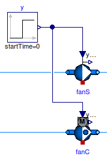
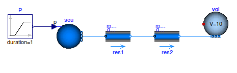
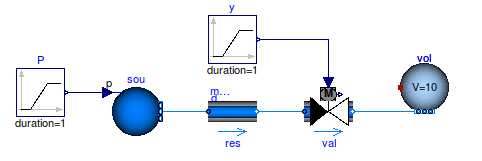
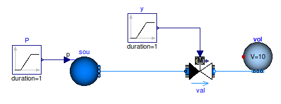
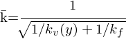

前ページ [2. ベストプラクティス](./2_BestPractice.md)　｜　次ページ [4. 前処理と後処理](./4_Pre-AndPost-Processing.md)
***  
  
# [3. エラーの回避](http://simulationresearch.lbl.gov/modelica/userGuide/workArounds.html)  
この章ではモデルの変換、初期化またはシミュレーション中に問題が発生した場合に役立つエラー防止策について説明します。
  
## 3.1. ステップ変動の回避  
すべての流体搬送機器（ファンおよびポンプ）はbooleanパラメータ`filteredFeed`を持っており、すべてのアクチュエータはbooleanパラメータ`filteredOpening`を持っています。デフォルト設定である`true`に設定されている場合、制御入力信号はステップ信号を滑らかな信号に変換する[二次ローパスフィルタ](./7_Glossary.md)に送られます。これにより通常はシミュレーションの堅牢性が向上します。  
フィルタの効果を確認するには、`fanS`を`filteredSpeed=false`、`fanC`を`filteredSpeed=true`と設定した以下のモデルを検討してみてください。どちらのファンもステップ入力信号に接続されています。`fanS`の設定により瞬時にファン速度が0から1に変化します。大きなシステムモデルではこれは高い計算負荷や収束問題につながります。 `fanC`はファン速度が連続的に変化することでソルバーが解を簡単に計算できるため、この問題を回避できます。このモデルではパラメータ`raiseTime=30`(秒)に設定しています。  
  
  
図 3.1 `filteredSpeed=false`（`fanS`）および`filteredSpeed=true`(`fanC`)と設定したファンの概略図  
  

図 3.2 0秒のときにステップ信号を入力したときの2つのファンの質量流量  
 
ファンやポンプの場合、フィルタによるダイナミクスは、ファンロータの回転慣性とダクトや配管ネットワーク内の流体の慣性を近似するものとして考えることができます。デフォルト値は`raiseTime=30`(秒)です。  
アクチュエータの場合、バルブの動作時間として近似します。デフォルト値は`raiseTime=120`(秒)です。  
  
|注意|
|:--|
|`filteredSpeed`（または`filteredOpening`）を変更する場合や`raiseTime`の値を変更する場合は,、閉ループ制御の動的応答が変更されます。したがって、十分な閉ループ制御性能を確保するためにはコントロールゲインを再調整する必要があります。 |
  
詳細は[流体搬送機器パッケージのユーザーガイド](http://simulationresearch.lbl.gov/modelica/releases/latest/help/Buildings_Fluid_Movers_UsersGuide.html)および[アクチュエータパッケージのユーザーガイド](http://simulationresearch.lbl.gov/modelica/releases/latest/help/Buildings_Fluid_Actuators_UsersGuide.html)を参照してください。
  
## 3.2. 数値ループの分離  
流体フローシステムでは、質量流量が分岐したり合流したりする流体ジャンクションにおいて非線形方程式系を結合することになります。このとき、より大きな系の連立方程式を解く必要がありますが、計算時間がより大きくなることが多く、場合によっては収束問題を引き起こす可能性があります。これらの方程式系を分離するには、フロースプリッタやミキサーのモデル([Buildings.Fluid.FixedResistances.PressureDrop](http://simulationresearch.lbl.gov/modelica/releases/latest/help/Buildings_Fluid_FixedResistances.html#Buildings.Fluid.FixedResistances.PressureDrop))またはファンやポンプのモデル( [Buildings.Fluid.Movers.SpeedControlled_y](http://simulationresearch.lbl.gov/modelica/releases/latest/help/Buildings_Fluid_Movers.html#Buildings.Fluid.Movers.SpeedControlled_y)など)においてパラメータ`dynamicBalance`を`true`に設定します。これにより、流体ジャンクションに式のシステムを切り離すことができる制御ボリュームが追加されます。

## 3.3. 直列接続した流動抵抗の非線形方程式の削減  
流体フローシステムでは複数の要素が直列に接続されている場合、個々の要素の流動摩擦による圧力降下の計算が連立非線形方程式系となる可能性があります。小さなモデルでは問題ありませんが、これにより反復解法を使用する際には膨大な計算時間がかかります。特に他の方程式を残差関数の一部とする大きなモデルでは計算時間が長くなります。
例示のために、流動抵抗を`res1`と`res2`としたときに、パラメータ`from_dp`が`true`に設定されている場合には[fig.inline3.1](./fig/inline3_1.png "fig.inline3.1")<!--\.m=k\ \sqrt[]{\Delta p}-->として質量流量を計算し、そうでなければ入口と出口との間の圧力降下を[fig.inline3.2](./fig/inline3_2.png "fig.inline3.2")<!--\Delta p=(\.m/k)^2-->として計算する下に示すような単純なシステムを考えます。（どちらの式もゼロに近い[正規化](./7_Glossary.md)を使用して実装されています）。

  
図3.3 ソースとボリュームを接続する2つの流動抵抗の直列回路図。

個々のコンポーネント個々のモデルの設定によっては、このシステムモデルをシミュレートすると質量流量または圧力降下を計算するために非線形方程式の反復解が必要になる場合があります。
非線形方程式を回避するには、以下のいずれかの方法を使用します。
* パラメータ`res2`を`dp_nominal=0`として設定し、かわりに圧力降下をモデル`res1`のパラメータ`dp_nominal`に追加します。これにより、`res2`で流動摩擦を計算する式がなくなり、非線形方程式を回避できます。予熱コイル、加熱コイル、冷却コイルなど、複数のコンポーネントが直列にある場合も同様です。
* すべてのコンポーネントでデフォルト設定の`from_dp=false`とします。これによりModelicaは圧力損失を質量流量の関数として計算する関数を使用します。したがって、コード変換器は質量流量を解く方程式を生成しやすくなり、それから質量流量を使用して直列に接続された要素の圧力降下を計算します。
制御弁もまたバルブのモデルへ圧力降下を集中させます。以下に示すように、固定された流動抵抗が制御バルブと直列である状況を考えてみましょう。


図3.4 固定された流動抵抗とソースとボリュームを接続する直列のバルブの概略図

パラメータを以下のように仮定します。
```  
Buildings.Fluid.FixedResistances.PressureDrop res(
redeclare package Medium = Medium,
m_flow_nominal=0.2,
dp_nominal=10000);
Buildings.Fluid.Actuators.Valves.TwoWayLinear val(
redeclare package Medium = Medium,
m_flow_nominal=0.2,
dpValve_nominal=5000);
```  

非線形方程式を避けるために、以下に示すように流動抵抗を削除することができます。


図3.5　ソースとボリュームを接続するバルブの概略図

もしバルブを以下のように設定している場合
```  
Buildings.Fluid.Actuators.Valves.TwoWayLinear val(
redeclare package Medium = Medium,
m_flow_nominal=0.2,
dpValve_nominal=5000,
dpFixed_nominal=10000);
```  
バルブは合成した流量係数[fig.inline3.3](./fig/inline3_3.png "fig.inline3.3")<!--\={k}-->を次のように計算します。
<!--\=k=\cfrac{1}{\sqrt[]{1/k_v(y)+1/k_f}}-->  
ここで、[fig.inline3.4](./fig/inline3_4.png "fig.inline3.4")<!--k_v(y)=\.m(y)/\sqrt[]{\Delta p}-->はリフト*y*におけるバルブの流量係数であり、[fig.inline3.5](./fig/inline3_5.png "fig.inline3.5")<!--k_f--> は`m_flow_nominal/sqrt（dpFixed_nominal）`の比に等しくなります。そして、バルブモデルは[fig.inline3.3](./fig/inline3_3.png "fig.inline3.3")<!--\={k}-->と固定抵抗について上述したのと同じ方程式を用いて圧力降下を計算します。したがって、複合モデルは同じ[バルブオーソリティ](./7_Glossary.md)と質量流量を持ちますが、非線形方程式は避けることができます。

詳細は[アクチュエータパッケージのユーザーガイド](http://simulationresearch.lbl.gov/modelica/releases/latest/help/Buildings_Fluid_Actuators_UsersGuide.html)を参照してください。

## 3.4. 質量流量を規定するモデル  
一部のシステムモデルでは、理想化されたポンプやファン（[Models.Fluid.Movers.FlowControlled_m_flow](http://simulationresearch.lbl.gov/modelica/releases/latest/help/Buildings_Fluid_Movers.html#Buildings.Fluid.Movers.FlowControlled_m_flow)）または必要な質量流量を出力するソース要素（[Buildings.Fluid.Sources.MassFlowSource_T](http://simulationresearch.lbl.gov/modelica/releases/latest/help/Buildings_Fluid_Sources.html#Buildings.Fluid.Sources.MassFlowSource_T)）を使用して質量流量を規定できます。これらのモデルを使用することで、ファン曲線と流れの抵抗の交点を計算する必要がなくなります。場合によっては、これでより高速でより堅牢なシミュレーションが可能になります。  
  
## 3.5. 過剰な初期化条件指定の回避  
熱流体フローシステムでは、Dymolaはモデルの変換に失敗したときに次のエラーメッセージを出力します。
```  
Error: The initialization problem is overspecified for variables
of element type Real
The initial equation
...
refers to variables, which are all knowns.
To correct it you can remove this equation.
```  
このメッセージが出力されたときは初期化条件が過剰に指定されています。流体ボリュームを含むモデルの場合は、これを避けるために次のように設定します。
```  
energyDynamics = Modelica.Fluid.Types.Dynamics.DynamicsFreeInitial;
massDynamics = Modelica.Fluid.Types.Dynamics.DynamicsFreeInitial;
```  
[水などの非圧縮性流体の参照圧力の節](./2_BestPractice.md)も参照してください。  
  
***  
前ページ [2. ベストプラクティス](./2_BestPractice.md)　｜　次ページ [4. 前処理と後処理](./4_Pre-AndPost-Processing.md)