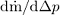

前ページ [4. 前処理と後処理](./4_Pre-AndPost-Processing.md)　｜　次ページ [6. ヘルプ](./6_Help.md)  
***  
  
# [5. 開発](http://simulationresearch.lbl.gov/modelica/userGuide/development.html)  
この章ではBuildingsライブラリの開発について説明します。  
## 5.1. 開発への貢献  
新しいモデルの提供やライブラリの改善方法の提案は大歓迎です。提供されたモデルは、ライブラリに統合してユーザーがアクセス可能にし、さらにそれらを維持するために必要となるため、次のガイドラインに準拠する必要があります。  
* 他のユーザーにとって一般的な関心があり、十分に文書化やテストが行われている。  
* 次のコーディング規則に従っている。 ・[the Buildings library user guide](http://simulationresearch.lbl.gov/modelica/releases/latest/help/Buildings_UsersGuide.html#Buildings.UsersGuide.Conventions) ・[the Modelica Standard Library user guide](http://simulationresearch.lbl.gov/modelica/releases/msl/3.2/help/Modelica_UsersGuide_Conventions.html#Modelica.UsersGuide.Conventions) ・[the Buildings library style guide](https://github.com/lbl-srg/modelica-buildings/wiki/Style-Guide)  
* [the Modelica license](http://simulationresearch.lbl.gov/modelica/releases/latest/help/Buildings_UsersGuide.html#Buildings.UsersGuide.License)の下で利用できる。  
* 流体フローコンポーネントのモデルの場合は、このパッケージの[ユーザーガイド](http://simulationresearch.lbl.gov/modelica/releases/latest/help/Buildings_Fluid_Interfaces_UsersGuide.html#Buildings.Fluid.Interfaces.UsersGuide) で説明している[Buildings.Fluid.Interfaces](http://simulationresearch.lbl.gov/modelica/releases/latest/help/Buildings_Fluid_Interfaces.html)の基底クラスに基づいている。（そうでないと実装が数値的に頑強であることの保証が困難になります。）  
  
ライブラリ開発のウェブサイトは[https://github.com/lbl-srg/modelica-buildings](https://github.com/lbl-srg/modelica-buildings)です。  
  
## 5.2. 新規クラスの追加  
モデルや関数などの新しいクラスを追加する最も簡単で一般的な方法は、既存のクラスの拡張やコピーや変更を行うことです。多くの場合、よく似たコンポーネントが既に存在します。このような状況では、そのようなコンポーネントをコピーして変更することをお勧めします。両方のコンポーネントで類似したコードを共有する量があまりに多い場合には、共通コードを実装する基底クラスを導入する必要があります。[Buildings.Fluid.Sensors.BaseClasses.PartialAbsoluteSensor](http://simulationresearch.lbl.gov/modelica/releases/latest/help/Buildings_Fluid_Sensors_BaseClasses.html#Buildings.Fluid.Sensors.BaseClasses.PartialAbsoluteSensor)を例として参照してください。 このモデルはパッケージ内に1つの流体ポート[Buildings.Fluid.Sensors](http://simulationresearch.lbl.gov/modelica/releases/latest/help/Buildings_Fluid_Sensors.html#Buildings.Fluid.Sensors)を持つすべてのセンサで共有されています。  
  
次の節では、熱流体フロー装置の実装と圧力降下モデルに特有な手引きを示します。  
  
### 5.2.1. 熱流体フロー装置  
熱流体フロー装置の構成要素を追加するには[Buildings.Fluid.Interface](http://simulationresearch.lbl.gov/modelica/releases/latest/help/Buildings_Fluid_Interfaces.html) パッケージにある拡張可能な基底クラスを使用します。 これらのクラスの説明については、[Buildings.Fluid.Interface.UsersGuide](http://simulationresearch.lbl.gov/modelica/releases/latest/help/Buildings_Fluid_Interfaces_UsersGuide.html#Buildings.Fluid.Interfaces.UsersGuide)を参照してください。
あるいは、以下のモデルのような単純なモデルを、熱流体フロー装置用の新しいモデルを実装するための元のモデルとして使用することができます。  
  
|||
|:--|:--|
|[Buildings.Fluid.HeatExchangers.HeaterCooler_u](http://simulationresearch.lbl.gov/modelica/releases/latest/help/Buildings_Fluid_HeatExchangers.html#Buildings.Fluid.HeatExchangers.HeaterCooler_u)|流体の流れに熱を加える装置|
|[Buildings.Fluid.MassExchangers.Humidifier_u](http://simulationresearch.lbl.gov/modelica/releases/latest/help/Buildings_Fluid_MassExchangers.html#Buildings.Fluid.MassExchangers.Humidifier_u)|流体の流れに湿度を加える装置|
|[Buildings.Fluid.Chillers.Carnot_y](http://simulationresearch.lbl.gov/modelica/releases/latest/help/Buildings_Fluid_Chillers.html#Buildings.Fluid.Chillers.Carnot_y)|2つの流体流の間で熱を交換する装置|
|[Buildings.Fluid.MassExchangers.ConstantEffectiveness](http://simulationresearch.lbl.gov/modelica/releases/latest/help/Buildings_Fluid_MassExchangers.html#Buildings.Fluid.MassExchangers.ConstantEffectiveness) | 2つの流体流の間で熱と湿気を交換する装置|  
  
### 5.2.2. 圧力降下  
圧力降下の式を実装するときは、基底クラス[Buildings.Fluid.BaseClasses.PartialResistance](http://simulationresearch.lbl.gov/modelica/releases/latest/help/Buildings_Fluid_BaseClasses.html#Buildings.Fluid.BaseClasses.PartialResistance). を拡張することをお勧めします。このようなモデルでは[Buildings.Fluid.BaseClasses.FlowModels.basicFlowFunction_dp](http://simulationresearch.lbl.gov/modelica/releases/latest/help/Buildings_Fluid_BaseClasses_FlowModels.html#Buildings.Fluid.BaseClasses.FlowModels.basicFlowFunction_dp)や[ Buildings.Fluid.BaseClasses.FlowModels.basicFlowFunction_m_flow](http://simulationresearch.lbl.gov/modelica/releases/latest/help/Buildings_Fluid_BaseClasses_FlowModels.html#Buildings.Fluid.BaseClasses.FlowModels.basicFlowFunction_m_flow)で実装されているように、ゼロ近傍で正則化された2次関数として流れの抵抗を計算できるようにするべきです。支配方程式は次のようになります。  
<!-- k = \cfrac{\.m}{\sqrt[]{\Delta p}} -->   
ニュートン法ベースのソルバーが動かなくなる可能性があるため、ゼロ近傍での正則化を使用することで極限<!--d\.m/d\Delta p-->が<!--\.m \to 0-->のときに無限大になる傾向を回避しています。流れの抵抗が固定値の場合は通常*k*は<!--k=\.m_0/\sqrt[]{\Delta p_0}-->のような公称条件に基づいて計算されます。ここで<!--\.m_0-->はパラメータ`m_flow_nominal`に等しく、<!--\Delta p_0-->はパラメータ `dp_nominal`に等しくなっています。  
  
すべての圧力降下モデルは、線形モデルの形式で方程式を置き換えることができるパラメータも提供する必要があります。  
  
<!-- \.m\.m_0=\bar{k}^2 \Delta p -->  
  
|注意|
|:--|
|圧力降下の式は体積流量ではなく質量流量の関数として実装されています。いくつかのモデルでは、このことにより質量バランスとエネルギーバランスを切り離すことができます。もしそうしていなければ、質量流量の分布を計算するには温度に依存する密度に関する知識が必要になります。しかも温度はエネルギーバランスを解いた後でのみ分かるのです。|  
  
圧力低下モデルを実装する際には,以下の項目の設定方法を実装してください。  
1. ホモトピーの使用（ホモトピーはデフォルトで使用している必要があります）  
2. 圧力低下モデルの無効化  
  
例えば、圧力降下モデルを無効にすることによって、は加熱コイルの圧力降下がゼロになるように加熱コイルと冷却コイルの直列接続を設定し、加熱コイルの圧力降下を圧力冷却コイルの圧力降下モデルに加えてまとめることができます。多くの場合これにより非線形方程式系のサイズを減少させることができます。  
  
***  
前ページ [4. 前処理と後処理](./4_Pre-AndPost-Processing.md)　｜　次ページ [6. ヘルプ](./6_Help.md)