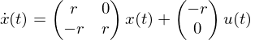
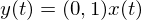
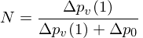

前ページ [6. ヘルプ Help](./6_Help.md)　｜　次ページ [8. 謝辞 Acknowledgments](./8_Acknowledgments.md)  
  
# [7. 用語集 Glossary](http://simulationresearch.lbl.gov/modelica/userGuide/glossary.html)  
## 二次ローパスフィルタ second order low pass filter  
2次のローパスフィルタは、以下の式を入出力するブロックです。  
<!-- \begin{equation}\dot{x}(t)=\begin{pmatrix}r&0\\-r&r\\\end{pmatrix}x(t)+\begin{pmatrix}-r\\0\\\end{pmatrix}u(t)\end{equation} -->  
<!-- \begin{equation}y(t)=(0,1)x(t)\end{equation} -->  
*r*は正の実数です。  
2次のローパスフィルタにより、入力信号*u*(⋅)は時間で微分可能な出力信号*y*(⋅)に変換されます。フィルタリングされたステップ応答のプロット図は[3. エラー防止 Work-Arounds](http://simulationresearch.lbl.gov/modelica/userGuide/workArounds.html)のFig. 3.2を参照してください。  
## 圧縮性流れ compressible flow  
非圧縮性流れの反対語です。  
## 非圧縮性流れ incompressible flow  
流体力学の非圧縮性流れとは、流体と共に移動する流体体積内において、質量密度が一定である流れのことを言います。  
## 反復ソルバー iterative solver  
反復ソルバーは近似解が収束条件を満たすまで計算を繰り返す数値ソルバーです。例として、非線形方程式系のニュートン法ソルバーと適応タイムステップサイズの常微分方程式ソルバーがあげられます。  
## 数値ノイズ numerical noise  
数値解における数値ノイズとは、一般的に変数の大きさがソルバーの許容誤差よりも小さいときに発生する、速いけれども小さい変化のことを指します。  
## 正則化 regularization  
正則化とは、微分可能で連続的かつ有界な導関数、すなわち連続的に微分可能な関数によって微分不可能な関数を近似することを意味しています。連続微分可能性は、ニュートン法ベースのソルバーが非線形方程式を解くために必要な条件です。  
## 状態変数 state variables  
状態変数は、時間変化率が微分方程式によって定義される変数です。  
## 熱流体システム thermo-fluid system  
熱流体システムは、中を流れる媒体に熱が加えられる熱交換器のような、物体とエネルギーの複合的な流れを計算するシステムです。  
## バルブオーソリティ valve authority  
制御バルブの場合、バルブオーソリティ*N*は次のように定義されます。  
<!-- \begin{equation}N=\frac{\Delta p_{v}(1)}{\Delta p_{v}(1)+\Delta p_0}\end{equation}) -->  
この式の分子は全開時のバルブの圧力降下であり、分母はバルブが制御する系統全体での圧力降下です。バルブオーソリティ*N*が0.5程度でかつそれを越えないようにバルブを設計するべきです。
  
前ページ [6. ヘルプ Help](./6_Help.md)　｜　次ページ [8. 謝辞 Acknowledgments](./8_Acknowledgments.md)