# [Modelica Buildings Library User Guide](http://simulationresearch.lbl.gov/modelica/userGuide/index.html)  
翻訳文最終更新：2018年10月17日  
  
このユーザーガイドでは、フリーかつオープンソースのModelica Buildingsライブラリの使用方法について説明しています。  
具体的には以下の内容を記載しています。  
* はじめに  
* モデルの作成やシミュレーションの実行におけるベストプラクティスの適用方法  
* モデルの変換やシミュレーションにおける一般的な問題解決方法  
* モデル入出力の前処理と後処理の自動化方法  
* 新しいモデルを開発してライブラリに貢献する方法  
* ヘルプ  
  
次の情報はこのドキュメントではなくライブラリ内のそれぞれのModelicaファイル(.mo)のannotationに記載されています。  
* モデルが基づく物理的な仮定および方程式  
* 類似の機器や物理現象に対して複数のモデルが利用可能な場合のモデル選択についてのアドバイス  
<div style="page-break-before:always"></div>  

# 目次  
## [1. はじめに](#chapter1)  
* [1.1. ユーザーのための文献](#chapter1-1)  
* [1.2. 開発者のための文献](#chapter1-2)  
* [1.3. ソフトウェア要件](#chapter1-3)  
* [1.4. はじめてのシミュレーションの実行](#chapter1-4)  
* [1.5. 参考文献](#chapter1-5)  
## [2. ベストプラクティス](#chapter2)  
* [2.1. パッケージの構成](#chapter2-1)  
* [2.2. 大規模システムモデルの構築](#chapter2-2)  
* [2.3. パラメータと媒体パッケージの伝播](#chapter2-3)  
* [2.4. 熱流体システム](#chapter2-4)  
    * [2.4.1. 過剰な初期化条件指定と矛盾した方程式](#chapter2-4-1)  
    * [2.4.2. 流体の接合部のモデリング](#chapter2-4-2)  
    * [2.4.3. 流体フローシステムでのセンサーの使用](#chapter2-4-3)  
    * [2.4.4. 水等の非圧縮性流体の基準圧力](#chapter2-4-4)  
    * [2.4.5. 公称値](#chapter2-4-5)  
* [2.5. 反復変数の初期値](#chapter2-5)  
* [2.6. イベントの回避](#chapter2-6)  
* [2.7. 制御](#chapter2-7)  
* [2.8. 遅いシミュレーションのデバッグと修正の例](#chapter2-8)  
    * [2.8.1. 状態イベント](#chapter2-8-1)  
    * [2.8.2. エラー制御を支配する状態変数](#chapter2-8-2)  
* [2.9. 数値ソルバー](#chapter2-9)  
## [3. エラーの回避](#chapter3)  
* [3.1. ステップ変動の回避](#chapter3-1)  
* [3.2. 数値ループの分離](#chapter3-2)  
* [3.3. 直列接続した流動抵抗の非線形方程式の削減](#chapter3-3)  
* [3.4. 質量流量を規定するモデル](#chapter3-4)  
* [3.5. 過剰な初期化条件指定の回避](#chapter3-5)  
## [4. 前処理と後処理](#chapter4)  
## [5. 開発](#chapter5)  
* [5.1. 開発への貢献](#chapter5-1)  
* [5.2. 新規クラスの追加](#chapter5-2)  
    * [5.2.1. 熱流体フロー装置](#chapter5-2-1)  
    * [5.2.2. 圧力降下](#chapter5-2-2)  
## [6. ヘルプ](#chapter6)  
## [7. 用語集](#chapter7)  
## [8. 謝辞](#chapter8)  
## [9. 免責事項](#chapter9)  
## [10. 著作権とライセンス](#chapter10)  
<div style="page-break-before:always"></div>  

<a id="chapter1"></a>

# [1. はじめに](http://simulationresearch.lbl.gov/modelica/userGuide/gettingStarted.html)  

<a id="chapter1-1"></a>

## 1.1. ユーザーのための文献  
新規ユーザーがはじめるにあたって役に立つ書籍を以下に示します。  
* Michael Tillerのインタラクティブな例を含む[オンラインブック](http://book.xogeny.com/)  
* Michael Tiller[Til2001]とPeter Fritzson([Fri2011]、[Fri2004])による本(1.5. 参考文献)  
* [https://www.modelica.org/publications](https://www.modelica.org/publications)に掲載されているチュートリアル  
  
[the Modelica Language Tutorial](https://www.modelica.org/documents/ModelicaTutorial14.pdf)は古いバージョン（Modelica 1.4）ですが、Modelica言語の概念を理解するためのものとしては現在でも有益で妥当な資料と言えます。  
  
Buildingsライブラリについての記述がある、または使用している論文は[http://simulationresearch.lbl.gov/modelica/publications.html](http://simulationresearch.lbl.gov/modelica/publications.html)にまとめています。また、ダウンロードページの[ドキュメント](http://simulationresearch.lbl.gov/modelica/releases/v5.1.0/help/Buildings.html)には、個々のパッケージを説明するユーザーガイドが含まれています。  
  
[The IEA EBC Annex 60 final report](http://www.iea-annex60.org/final-report.html) ではFMI規格に基づく連成シミュレーションのためのMoodelicaモデルやアプローチやツールの開発、IFCに基づくBIM技術、ワークフロー自動化のためのツールについてまとめられています。また、建物やコミュニティのエネルギーシステムを設計、運用する際にこれらの技術を適用した多くの事例も含まれています。  
  
ModelicaのインタラクティブなWebベースのツアーは[http://modelica.university/res/lesson/training.json](http://modelica.university/res/lesson/training.json)で利用できます。  
  
初心者のための音声チュートリアルは[http://spoken-tutorial.org/tutorial-search/?search_foss=OpenModelica&search_language=English](http://spoken-tutorial.org/tutorial-search/?search_foss=OpenModelica&search_language=English)で利用できます。  
  
<a id="chapter1-2"></a>

## 1.2. 開発者のための文献  
新しく熱流体モデルを開発する際にはストリームコネクタの概念を理解することが重要です。ストリームコネクタについては[https://www.modelica.org/documents](https://www.modelica.org/documents)の[Modelicaの言語定義](https://www.modelica.org/documents/ModelicaSpec34.pdf)やFrankeらによる[論文[Fra2009a]](https://www.modelica.org/events/modelica2009/Proceedings/memorystick/pages/papers/0078/0078.pdf)に説明があります。Buildingsライブラリは、Modelica.Fluidライブラリと類似したモデリング規則や同じ基底クラスを使用しているため、Modelica.Fluidの熱流体モデルの標準化についての[論文[Fra2009b]](https://www.modelica.org/events/modelica2009/Proceedings/memorystick/pages/papers/0077/0077.pdf)を読むことをすすめます。  
Xogenyの[Modelica Web Reference](http://modref.xogeny.com/)は、Modelica言語の簡潔な概要と説明、さらなる情報のリンクを提供しています。  
  
<a id="chapter1-3"></a>

## 1.3. ソフトウェア要件  
[http://simulationresearch.lbl.gov/modelica/download.html](http://simulationresearch.lbl.gov/modelica/download.html)にあるそれぞれのバージョンのBuildingsライブラリのソフトウェア要件を確認してください。 バージョン5.1.0においてはModelica標準ライブラリ3.2.2が必要であり、動作確認はDymola2018FD01とJModelica(revision 11291)において行われています。  
  
<a id="chapter1-4"></a>

## 1.4. はじめてのシミュレーションの実行  
Modelicaをはじめるにあたり、まずはBuildingsライブラリのサンプルモデルを実行します。これらの例を用いてモデルパラメータの値を変更したり、既存のモデルを新しいものに置き換えることによってバリエーションを作成してみましょう。サンプルモデルはExamplesパッケージに、システムモデルを一つずつ構築する詳細なチュートリアルは[Tutorial](http://simulationresearch.lbl.gov/modelica/releases/latest/help/Buildings_Examples_Tutorial.html)パッケージにあります。  
  
注）Buildings.HeatTransfer.*.Examplesにある熱伝達モデルは以下の理由により流体流動モデルよりも理解しやすくなっています。  
* 流体の流れを扱う場合は流れの逆転（質量流量が方向を変える場合）により複雑さが増してしまいます。  
* 流体流動モデルは空気や水蒸気、CO2のような微量物質など複数の種類の物質を扱う必要があるかもしれません。  
* 流体流動モデルは、乾燥空気、湿った空気、水または他の流体のような媒体モデルを定義するパッケージを使用しています。  
  
<a id="chapter1-5"></a>

## 1.5. 参考文献  
|||
|:-:|:--|
|[Fri2004]|Peter Fritzson. Principles of Object-Oriented Modeling and Simulation with Modelica 2.1. John Wiley & Sons,2004.|
|[Fri2011]|Peter Fritzson. Introduction to Modeling and Simulation of Technical and Physical Systems with Modelica.Wiley-IEEE Press, ISBN 978-1-1180-1068-6, 2011.|
|[Fra2009a]|R. Franke, F. Casella, M. Otter, M. Sielemann, H. Elmqvist, S. E. Mattsson, and H. Olsson. [Stream connectors – an extension of modelica for device-oriented modeling of convective transport phenomena.](https://www.modelica.org/events/modelica2009/Proceedings/memorystick/pages/papers/0078/0078.pdf) In F. Casella, editor, Proc. of the 7-th International Modelica Conference, Como, Italy, Sept. 2009.|
|[Fra2009b]|R. Franke, F. Casella, M. Otter, K. Proelss, M. Sielemann, and M. Wetter. [Standardization of thermo-fluid modeling in Modelica.Fluid.](https://www.modelica.org/events/modelica2009/Proceedings/memorystick/pages/papers/0077/0077.pdf) In F. Casella, editor, Proc. of the 7-th International Modelica Conference, Como, Italy, Sept. 2009.|
|[Til2001]|Michael M. Tiller. Introduction to Physical Modeling with Modelica. Kluwer Academic Publisher, 2001.|
<div style="page-break-before:always"></div>  

<a id="chapter2"></a>

# [2. ベストプラクティス](http://simulationresearch.lbl.gov/modelica/userGuide/bestPractice.html)  
この章ではライブラリユーザーが新しいシステムモデルを作成する際のベストプラクティスを説明しています。ここで取り上げたトピックはModelicaをはじめて扱うユーザーによく見られる問題に基づいています。Modelicaの経験が豊富なユーザーは、この章をスキップしてよいでしょう。  
  
<a id="chapter2-1"></a>

## 2.1. パッケージの構成  
モデルを開発するときは、Buildingsライブラリのように広く適用されるモデルを含むライブラリと、特定の建物用に作成されて他のアプリケーションでの使用が制限されるアプリケーション固有のモデルを区別する必要があります。そしてアプリケーション固有のモデルはBuildingsライブラリの外に格納することをお勧めします。これにより、ユーザーはアプリケーション固有のモデルを変更することなくBuildingsライブラリを新しいバージョンに置き換えることができます。アプリケーション固有のモデルの開発中に、それが他のアプリケーションにも関係するモデルであると思った場合は、[「開発」](#chapter5)セクションで説明しているように、Buildingsライブラリの開発に貢献することができます。）。  
  
<a id="chapter2-2"></a>

## 2.2. 大規模システムモデルの構築  
大規模なシステムモデルを作成する場合には、通常は分離してテストできるサブシステムモデルを組み合わせることでより容易にシステムモデルを構築することができます。例えば、[Buildings.Examples.ChillerPlant.BaseClasses.Controls.Examples](http://simulationresearch.lbl.gov/modelica/releases/latest/help/Buildings_Examples_ChillerPlant_BaseClasses_Controls_Examples.html)パッケージには大規模システムモデルである[Buildings.Examples.ChillerPlant](http://simulationresearch.lbl.gov/modelica/releases/latest/help/Buildings_Examples_ChillerPlant.html)を構成する個々のコンポーネントをテストするための小さなテストモデルが含まれています。小さなテストモデルを作成することで、制御の適切な応答とサブシステムの適切な操作を、大規模なモデルに存在する複雑なシステム相互作用から分離してテストできるため、通常は時間を節約することができます。  
  
<a id="chapter2-3"></a>

## 2.3. パラメータと媒体パッケージの伝播  
ポンプ`pum`および質量流量センサ`sen`を備えたモデルを考えます。両方のモデルが公称質量流量のパラメータ`m_flow_nominal`を持ち、同じ値に設定する必要があると仮定します。これらのパラメータは個別に数値に設定するのではなく、モデルの最上位でのパラメータを伝播させることをお勧めします。そのため、次のような宣言の使用は推奨しません。  
```  
Pump pum(m_flow_nominal=0.1) "Pump";
TemperatureSensor sen(m_flow_nominal=0.1) "Sensor";
```  
次のような宣言を使用することを推奨します。  
```  
Modelica.SIunits.MassFlowRate m_flow_nominal = 0.1
                              "Nominal mass flow rate";
Pump pum(m_flow_nominal=m_flow_nominal) "Pump";
TemperatureSensor sen(m_flow_nominal=m_flow_nominal) "Sensor";
```  
これにより、ある場所で`m_flow_nominal`の値を変更した際に、その値を参照するすべてのモデルにその値を伝播させることができます。モデルの変更がより簡単でより堅牢になるので、追加の宣言のために一手間かけておくことは一般に効果的です。  
  
パラメータとパッケージを伝播させることは媒体の定義にとって特に重要です。これにより、ユーザーは1つの場所で媒体宣言を変更し、それを参照するすべてのモデルに伝播させることができます。これは次のような宣言を使用して行うことができます。  
```  
replaceable package Medium = Modelica.Media.Interfaces.PartialMedium
  "Medium model for air" annotation (choicesAllMatching=true);
```  
ここで、オプションの注釈`annotation (choicesAllMatching=true) `が追加され、`Modelica.Media.Interfaces.PartialMedium`から継承するすべての媒体モデルを含むドロップダウンメニューがGUIに表示されます。  
上記のセンサが媒体モデルを必要とする可能性は高いと思われますが、その場合は次のように宣言します。  
```  
TemperatureSensor sen(redeclare package Medium = Medium,
                      m_flow_nominal=m_flow_nominal) "Sensor";
```  
システムモデルの最上位では、次のようにして`Medium`パッケージを実際の媒体に設定します。  
```
package Medium = Buildings.Media.PerfectGases.MoistAir "Medium model";
TemperatureSensor sen(redeclare package Medium = Medium,
                      m_flow_nominal=m_flow_nominal) "Sensor";
```  
  
<a id="chapter2-4"></a>

## 2.4. 熱流体システム  
この節では熱流体システムのモデリングに特有なベストプラクティスについて説明します。  
  
<a id="chapter2-4-1"></a>

### 2.4.1. 過剰な初期化条件指定と矛盾した方程式  
ここでは温度や圧力などの状態変数を初期化する方法について説明します。  
下の図のように直列に接続された質量流量ソース`Models.Fluid.Sources.MassFlowSource_T`、流体ボリューム`Buildings.Fluid.MixingVolumes.MixingVolume`と固定境界条件`Buildings.Fluid.Sources.FixedBoundary`からなるモデルを考えます。インスタンス`bou`がポートで媒体の圧力を設定する式を実装していること、すなわち圧力ポート`bou.ports.p`は固定されてることに注意してください。  
  
  
図2.1 質量流量ソース、流体ボリューム、圧力ソースの概略図  
  
このボリュームでは4つの異なる方法でエネルギーと質量のバランス方程式を設定できます。ボリュームの圧力*p*(⋅) 、初期圧力のパラメータ<!--p_0-->、ボリュームに含まれる質量*m*(⋅) 、ボリュームのi番目の流体ポートの質量流量<!--\.m_i-->(⋅)、流体ポートの数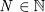<!--\textit{N} \in \mathbb{N}-->(⋅)、初期の時間<!--t_0-->を設定します。それから、流体容積の質量バランスの式を以下の表に示すように設定することができます。  
  
|パラメーター<br>massDynamicsの値|初期化条件<br>if ρ=ρ(*p*)|初期化条件<br>if ρ≠ρ(*p*)|時間進行時に使用する方程式<br>|
|:--|:--|:--|:--|
|`DynamicsFreeInitial`|Unspecified|Unspecified|<!--dm\left( t\right) /dt=\sum ^{N}_{i=1}\.m_{i}\left( t\right)-->|
|`FixedInitial`|<!--p\left( t_{0}\right) =p_{0}-->|Unspecified|<!---->|
|`SteadyStateInitial`|<!--dp\left( t_{0}\right) /dt=0-->|Unspecified|<!---->|
|`SteadyState`|Unspecified|Unspecified|<!--0=\sum ^{N}_{i=1}\.m_{i}\left( t\right)-->|  
  
*Unspecified*は、初期値に対して式が宣言されていないことを意味します。この状況は2つの場合があります。  
1. 上記モデルにおいてモデルが接続するためにシステムモデルで圧力を`vol.p=vol.ports.p=bou.ports.p`と設定した場合、そのボリュームの圧力 p(t0)は`bou.ports.p`に等しくなります。  
2. システムモデルで圧力を設定しない場合（つまり、`vol`と`bou`が互いに接続されていない場合）、圧力は値`p(start=Medium.p_default)`から開始します。ここで*Medium*は媒体モデルの名前を示しています。  
  
`Buildings.Fluid.Sources.FixedBoundary`モデルはポートの圧力を固定しているため、初期状態p(t0)=p0とdp(t0)/dt=0では上に示したモデルにとって過剰に条件指定したシステムになります。このような状況を回避するには、異なる初期条件を使用するか流体ボリュームと固定境界条件の間に流動抵抗を追加します。流動抵抗は、流体ボリュームと固定境界条件の圧力を質量流量の関数として関連づける式を導入し、それにより不一致を取り除きます。  
  
|警告|
|:--|
|`FixedInitial`設定は注意して使用しなければなりません。圧力ダイナミクスが速いため、この設定によりシミュレーションの開始時に非常に高速な過渡状態にが引き起こされます。このような過渡現象は微分方程式ソルバーの数値問題を引き起こす可能性があります。|
  
同様にエネルギー収支については、ボリュームが貯蔵するエネルギー、ボリュームの温度、ボリュームのi番目の流体コネクタを通過する単位質量あたりの比エンタルピーを運ぶ質量流量、ボリュームの熱ポートでの熱流を設定します。  
そして、エネルギーバランスの式は次の表に示すように設定できます。  
<div style="page-break-before:always"></div>  
  
|パラメーター<br>energyDynamicsの値|初期化条件|時間進行時に使用する方程式|
|:--|:--|:--|
|`DynamicsFreeInitial`|Unspecified|<!--dU\left( t\right) /dt=\sum ^{N}_{i=1}\.m_{i}\left( t\right)h_{i}\left( t\right) +\.Q\left( t\right) -->|
|`FixedInitial`|<!--T\left( t_{0}\right) =T_{0}-->|<!---->|
|`SteadyStateInitial`|<!--dT\left( t_{0}\right) /dt=0-->|<!---->|
|`SteadyState`|Unspecified|<!--0=\sum ^{N}_{i=1}\.m_{i}\left( t\right)h_{i}\left( t\right) +\.Q\left( t\right)-->|  
  
*Unspecified*は、 T(t0)について式が宣言されていないことを意味します。この状況は2つの場合があります。
1. システムモデルで温度を設定する場合（すなわち、モデル内で*vol*の熱ポートが固定温度に接続されている場合）、そのボリュームのT(t0)はこのポートに接続された温度に等しくなります。
2. システムモデルで温度を設定しない場合、温度は`T(start=Medium.T_default)`から開始します。ここで、*Medium*は媒体モデルです。  
  
|注意|
|:--|
|1. エネルギーバランスに対して`SteadyState`を選択して質量バランスに対して`SteadyState`を選択しないことは矛盾した方程式につながる可能性があります。モデルはこの状況をチェックし、エラーメッセージを出力して変換を停止します。方程式が矛盾する理由を調べるには、2つの流体ポートを持ち、熱ポートを持たないボリュームを考えます。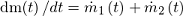<!--dm\left( t\right) /dt=\.m_{1}\left( t\right)+\.m_{2}\left( t\right)-->であるため、<!--\.m_{1}\left( t\right)\neq 0--> かつ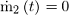<!--\.m_{2}\left( t\right)= 0-->となる可能性があります。しかし、エネルギーバランスの式は熱ポートがないため、 <!--\.Q\left( t\right)= 0-->として<!--0=\sum ^{2}_{i=1}\.m_{i}\left( t\right)h_{i}\left( t\right) +\.Q\left( t\right)-->となります。したがって<!--0=\.m_{1}\left( t\right)h_{1}\left( t\right)-->となり矛盾してしまいます。<br>2. 圧力初期化の場合とは異なり、モデル`bou`の温度は初期の時点で`vol.T=bou.T`にはなりません。これは、物理的に`bou`と`vol`の温度が異なってもよいためです。|  
  
質量分率のダイナミクス（水蒸気濃度など）と微量物質のダイナミクス（二酸化炭素濃度など）の式は、エネルギー方程式に類似しています。  
ボリュームの中の物質の質量X(⋅)、ボリュームの初期質量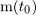<!--m\left( t_{0}\right)-->、ボリュームの中の選択した物質の濃度x0、i番目の流体ポートの物質の濃度xi(⋅) 、外部から加えられた物質<!--\.X--> (⋅)（例えば、加湿器によって加えられた水蒸気）を設定します。そして、物質のダイナミクスは次の表に示すように設定できます。  
<div style="page-break-before:always"></div>  
  
|パラメーター<br>massDynamicsの値|初期化条件|時間進行時に使用する方程式|
|:--|:--|:--|
|`DynamicsFreeInitial`|Unspecified|<!--dX\left( t\right) /dt=\sum ^{N}_{i=1}\.m_{i}\left( t\right)x_{i}\left( t\right) +\.X\left( t\right)-->|
|`FixedInitial`|<!--x\left( t_{0}\right) =m\left( t_{0}\right) x_{0}-->|<!---->|
|`SteadyStateInitial`|<!--dX\left( t_{0}\right) /dt=0-->|<!---->|
|`SteadyState`|Unspecified|<!--0=\sum ^{N}_{i=1}\.m_{i}\left( t\right)x_{i}\left( t\right) +\.X\left( t\right)-->|
  
微量物質のダイナミクスの式は質量分率のダイナミクスの式と同一であり、X(⋅),<!--\.X-->(⋅)  xi(⋅)をC(⋅),<!--\.C-->(⋅) そして ci(⋅)で置き換えるとき、C(⋅)はボリューム中の微量物質、ci(⋅)はi番目の流体ポートにおける微量物質濃度、<!---->(⋅)は外部から加えられる微量物質の質量流量となります。したがって、エネルギー、質量分率および微量物質は、同一の方程式および設定を持つことになります。  
<a id="chapter2-4-2"></a>

### 2.4.2. 流体の接合部のモデリング  
Modelicaでは、以下に示すように流体ポートを接続することで接合部で理想的な混合が行われます。下記のような状況では、複数のコネクタを流体ポートに接続することは、モデル化しようとしている物理現象を表しています。  
  
  
図2.2 合流または分岐モデルを明示的に導入しない3つのコンポーネントの接続  
  
しかし、より複雑なフロー構成では配管ネットワークやダクトネットワークにおけるどの分岐が合流するかを明示的に制御したい場合があります。これは、下の左の図（テストモデル[BoilerPolynomialClosedLoop](http://simulationresearch.lbl.gov/modelica/releases/latest/help/Buildings_Fluid_Boilers_Examples.html#Buildings.Fluid.Boilers.Examples.BoilerPolynomialClosedLoop)の一部）に示すようにモデル[PressureDrop](http://simulationresearch.lbl.gov/modelica/releases/latest/help/Buildings_Fluid_FixedResistances.html#Buildings.Fluid.FixedResistances.PressureDrop)のインスタンスを使用することで実現できます。  
  
  
図2.3 混合または分岐モデルを使用したコンポーネントの正しい接続（左）と間違った接続（右）  
  
左の図では、合流地点が流れを混合または分岐する三方向モデルの使用によって正しく定義されています。合流または分岐モデルの公称圧力降下をゼロに設定することで、流れ抵抗の式は導入されないように合流または分岐モデルを単純化することできます。さらに、バルブに接続する分岐部では圧力降下をモデル化することができ、それがバルブオーソリティに影響を与えます。しかし右の図では、ポートAから出る流れはポートBでボリューム`vol`からの流れと合流し、ポートCに流れます。したがって、バルブに誤った温度が与えられることになります。  
  
<a id="chapter2-4-3"></a>

### 2.4.3. 流体フローシステムでのセンサーの使用  
センサーモデルを選択する場合、測定量が流れの方向に依存するかどうかを区別する必要があります。測定量が温度や相対湿度などのように流れ方向に依存する場合は、[Buildings.Fluid.Sensors](http://simulationresearch.lbl.gov/modelica/releases/latest/help/Buildings_Fluid_Sensors.html#Buildings.Fluid.Sensors)ライブラリの2つのポートを持つセンサーを使用する必要があります。これらのセンサは流れがその方向を逆転させる状況に対して1つのポートを有するセンサよりも効率的な実装となっています。適切な使用センサーについては、[Buildings.Fluid.Sensors](http://simulationresearch.lbl.gov/modelica/releases/latest/help/Buildings_Fluid_Sensors.html#Buildings.Fluid.Sensors)パッケージの[ユーザーガイド](http://simulationresearch.lbl.gov/modelica/releases/latest/help/Buildings_Fluid_Sensors_UsersGuide.html)に記載されています。  
  
<a id="chapter2-4-4"></a>

### 2.4.4. 水等の非圧縮性流体の基準圧力  
この節では非圧縮性流体の基準圧力を設定する方法について説明します。温度の関数として密度をモデル化する流体の場合には、流体の熱膨張をどのように考慮するかについても示しています。  
以下に示すポンプまたはファン、流動抵抗およびボリュームからなる流れ回路を考えます。  
  
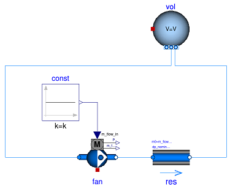  
図2.4 基準圧力を設定する方法や流体の熱膨張を考慮する方法がない流れ回路の概略図

このモデルが媒体モデル[Buildings.Media.Air](http://simulationresearch.lbl.gov/modelica/releases/latest/help/Buildings_Media_Air.html#Buildings.Media.Air)のような[圧縮性流れ](#chapter7)をモデル化する媒体モデルと共に使用されるとき、気体媒体が*p=ρRT*の式を実装しているので明確に定義されているといえます。ここで*p*は静圧、*ρ*は質量密度、*R*は気体定数、*T*は絶対温度を示します。  
しかし、媒体モデルが[Buildings.Media.Water](http://simulationresearch.lbl.gov/modelica/releases/latest/help/Buildings_Media_Water.html#Buildings.Media.Water)などの[非圧縮性流れ](#chapter7)をモデル化するモデルに変更された場合は密度は一定となります。したがって、体積から圧力を計算するために使用できる方程式がなくなってしまいます。この状況でモデルを変換しようとすると、Dymolaで次のエラーメッセージが表示されます。  
```  
The DAE has 151 scalar unknowns and 151 scalar equations.
Error: The model FlowCircuit is structurally singular.
The problem is structurally singular for the element type Real.
The number of scalar Real unknown elements are 58.
The number of scalar Real equation elements are 58.
```  
同様に、圧力とエンタルピーの関数として密度をモデル化する媒体モデル[Buildings.Media.Specialized.Water.TemperatureDependentDensity](http://simulationresearch.lbl.gov/modelica/releases/latest/help/Buildings_Media_Specialized_Water_TemperatureDependentDensity.html#Buildings.Media.Specialized.Water.TemperatureDependentDensity)を使用する場合はモデルは適切に定義されていますが、圧力はポンプが稼動する時間が長くなるほど大きくなります。これはポンプが水に熱を加えているためです。水温が*20℃*から*40℃*に上昇すると、圧力は*1bars*から*150bar*に増加します。  
<div style="page-break-before:always"></div>  

この特異性や圧力上昇を避けるには、圧力ソースを与えて流体の膨張を考慮するモデルを使用します。例えば、[Buildings.Fluid.Storage.ExpansionVessel](http://simulationresearch.lbl.gov/modelica/releases/latest/help/Buildings_Fluid_Storage.html#Buildings.Fluid.Storage.ExpansionVessel)を使用して、以下に示すシステムモデルを作成します。  
  
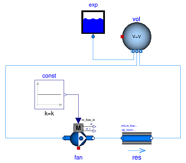  
図2.5 圧力ソースの追加と媒体の熱膨張を考慮する膨張タンクを備えた流れ回路の概略図  
  
別の方法として[Buildings.Fluid.Sources.FixedBoundary](http://simulationresearch.lbl.gov/modelica/releases/latest/help/Buildings_Fluid_Sources.html#Buildings.Fluid.Sources.FixedBoundary)を使用することもできます。これは圧力を一定値に設定し、圧力を維持するために必要に応じて流体を追加または除去します。  [Buildings.Fluid.Sources.FixedBoundary](http://simulationresearch.lbl.gov/modelica/releases/latest/help/Buildings_Fluid_Sources.html#Buildings.Fluid.Sources.FixedBoundary)モデルを使うと一般的に[Buildings.Fluid.Storage.ExpansionVessel](http://simulationresearch.lbl.gov/modelica/releases/latest/help/Buildings_Fluid_Storage.html#Buildings.Fluid.Storage.ExpansionVessel)より簡単な方程式になります。  [Buildings.Fluid.Sources.FixedBoundary](http://simulationresearch.lbl.gov/modelica/releases/latest/help/Buildings_Fluid_Sources.html#Buildings.Fluid.Sources.FixedBoundary)の流体ポートから流出する媒体は固定温度ですが、[Buildings.Fluid.Storage.ExpansionVessel](http://simulationresearch.lbl.gov/modelica/releases/latest/help/Buildings_Fluid_Storage.html#Buildings.Fluid.Storage.ExpansionVessel)モデルはエネルギーを保存します。しかし、流体の熱膨張は通常小さいので、この影響はほとんどの建物のHVAC用途では無視することができます。  
  
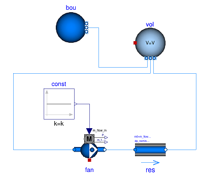  
図2.6 固定圧力ソースを追加し媒体の熱膨張を考慮する境界モデルを備えた流れ回路の概略図  
<div style="page-break-before:always"></div>  
  
|注意|
|:--|
|それぞれの水回路には、[Buildings.Fluid.Storage.ExpansionVessel](http://simulationresearch.lbl.gov/modelica/releases/latest/help/Buildings_Fluid_Storage.html#Buildings.Fluid.Storage.ExpansionVessel)インスタンスか[Buildings.Fluid.Sources.FixedBoundary](http://simulationresearch.lbl.gov/modelica/releases/latest/help/Buildings_Fluid_Sources.html#Buildings.Fluid.Sources.FixedBoundary)インスタンスが1つだけ存在する必要があります。このようなデバイスがない場合は絶対圧力が定義されないか、そうでなければ媒体密度が変化する場合には非現実的な大きな値に上昇するかもしれません。デバイスが複数ある場合はシステムに基準静圧を設定する複数のポイントがあることになります。これは質量流量の分布に影響を与えます.|  
  
<a id="chapter2-4-5"></a>

### 2.4.5. 公称値  
ほとんどのコンポーネントには公称動作条件のパラメータがあります。これらのパラメータは`_nominal`で終わる名前を持ち、全負荷または設計条件で動作する場合にコンポーネントが通常持つことになる値を設定する必要があります。モデルによってはこれらのパラメータが異なった用途に使用されるので、それぞれのモデルのドキュメントやコードを参照して詳細を確認する必要があります。ただし、以下の表はさまざまなモデルの典型的なパラメータの使用法を理解するのに役立ちます。  
  
|パラメータ|モデル|説明|
|:--|:--|:--|
|`m_flow_nominal`<br>`dp_nominal`|流動抵抗モデル|これらのパラメータを使用してP-Q曲線上の点を定義することができます。他の質量流量については、圧力降下は一般的に相似法則を用いて調整されます。 [PressureDrop](http://simulationresearch.lbl.gov/modelica/releases/latest/help/Buildings_Fluid_FixedResistances.html#Buildings.Fluid.FixedResistances.PressureDrop)を参照してください。|
|`m_flow_nominal`<br>`m_flow_small`|センサー<br>ボリューム<br>熱交換器|これらのモデルの中には、デフォルト値として`m_flow_small=1E-4*abs(m_flow_nominal)`を設定するものがあります。そして`m_flow_small`は、質量流量が`m_flow_small`より小さい場合に方程式を正則化したり置き換えたりするために使用されます。この操作はモデルの数値的性質を改善するために必要となります。設計流量から0.01％以下の流量ではほとんどのモデルの仮定は適用されず、HVACシステムはこの領域では動作しないため、結果の誤差は一般的なアプリケーションでは無視できます。Modelicaは連続時間領域でシミュレートするのでこのような小さな流量が発生する可能性があり、モデルをゼロまたはほぼゼロの流量で数値的に適切に動作するように実装します。|
|`tau`<br>`m_flow_nominal`|センサー<br>ボリューム<br>熱交換器<br>チラー|Modelicaは連続時間領域でシミュレーションするため、動的モデルは一般に定常状態モデルよりも数値的に効率的となります。しかし、動的モデルは一般に製造業者によって公表されていない製品データを必要とします。例としては装置に含まれる流体の量や熱交換器の重量などがあります。さらに、チラーの配管や熱交換器の輸送遅延などの他の影響は一般には知られておらず、設計段階では一般的に利用できない詳細な形状が必要です。<br>この問題を回避するために、多くのモデルがパラメータとして時定数`tau`をとり、その熱的なまとまりをすべて流体ボリュームに集中させます。時定数`tau`は、ステップ変化の入力を与えたときにコンポーネントの質量流量が`m_flow_nominal`に等しくなる場合に観測できる時定数として理解することができます。これらの2つの値と流体密度`rho`を使用して、ボリュームに特定の時間応答を与えるためにコンポーネントのボリュームを`V=m_flow_nominal tau/rho`のように調整します。ほとんどのコンポーネントでは、エンジニアリングの経験を使って`tau`の妥当な値を見積もることができ、一般的に適用可能な値を使用できる場合にはデフォルト値としてすでに`tau`を設定してあります。例としては[WetCoilDiscretized](http://simulationresearch.lbl.gov/modelica/releases/latest/help/Buildings_Fluid_HeatExchangers.html#Buildings.Fluid.HeatExchangers.WetCoilDiscretized)を参照してください。|  
  
<a id="chapter2-5"></a>

## 2.5. 反復変数の初期値  
非線形方程式系の数値解法では一般にニュートン法ベースのソルバーが使用されます。このようなソルバーは、反復変数に良好な初期値が与えられればより良好に収束する可能性が高くなります。 Dymolaではどのような初期値が使用されているかを確認するために、シミュレーションタブに次のようなコマンドを入力します。  
```  
Advanced.LogStartValuesForIterationVariables = true;
```  
そして例えば次のようにモデルを変換するときに、  
```  
translateModel("Buildings.Fluid.Boilers.Examples.BoilerPolynomialClosedLoop");
```  
次のような形式で出力されます。  
```  
Start values for iteration variables:
 val.res1.dp(start = 3000.0)
 val.res3.dp(start = 3000.0)
```  
ここで反復変数とその初期値が表示されます。初期値はモデル上で上書きすることができます。  
  
<a id="chapter2-6"></a>  
  
<div style="page-break-before:always"></div>  
  
## 2.6. イベントの回避
Modelicaでは、Real型の変数*x*と*y*において*x>y*などの`Real`型要素の演算で値が変わるときにいつも時間積分が停止します。この状況ではイベントが発生しており、その関係式が値を変更する間はソルバーが時間間隔を小さくしています。この時間間隔の選定は、反復計算が大きな方程式系の評価を必要とする場合に計算時間を大幅に増加させる可能性があります。このようなイベントが発生する例としては次のような関係のときがあります。  
```  
if port_a.m_flow > 0 then
  T_in = port_a.T;
else
  T_in = port_b.T;
end if;
```  
すなわち次のようなときです。  
```  
T_in = if port_a.m_flow > 0 then port_a.T else port_b.T;
```  
そのようなコードを含むモデルをシミュレートする場合、時間積分では`port_a.m_flow`がゼロと交差する時刻を見つけるために反復計算をします。モデルを仮定することによって`port_a.m_flow=0`付近の近似式を作成できる場合、関係式(比較演算式)をイベントの反復を必要としない近似式で置き換えることで計算時間を短縮できます。  
例えば、上記の式は次のように近似できます。  
```  
T = Modelica.Fluid.Utilities.regStep(
  port_a.m_flow, T_a_inflow, T_b_inflow,
  m_flow_nominal*1E-4);
```  
ここで、`m_flow_nominal`は全負荷時のモデルの質量流量近傍に設定されたパラメータです。流量の大きさが典型的な流量の1E-4倍より大きい場合は近似式は正確な式と同じであり、その値より下では近似式が使用されます。しかしながら、このような小さな流速では多くのエネルギーは輸送されないため、近似によってもたらされる誤差は一般に無視できます。  
場合によってはモデルにダイナミクスを追加すると計算時間がさらに向上する場合があります。例えば[数値ノイズ](#chapter7)により引数`port_a.m_flow`が`+/- 1E-4*m_flow_nominal`の範囲で振動したときに[Modelica.Fluid.Utilities.regStep](http://simulationresearch.lbl.gov/modelica/releases/msl/3.2)の戻り値が急激に変化する可能性があるためです。次のような定式化によりダイナミクスを加えることができます。  
```  
TMed = Modelica.Fluid.Utilities.regStep(
  port_a.m_flow, T_a_inflow, T_b_inflow,
  m_flow_nominal*1E-4);
der(T)=(TMed-T)/tau;
```  
ここで、`tau>0`は時定数とします。堅牢な実装の例としては[Buildings.Fluid.Sensors.TemperatureTwoPort](http://simulationresearch.lbl.gov/modelica/releases/latest/help/Buildings_Fluid_Sensors.html#Buildings.Fluid.Sensors.TemperatureTwoPort)を参照してください。  
  
|注意|
|:--|
|[Buildings.Utilities.Math](http://simulationresearch.lbl.gov/modelica/releases/latest/help/Buildings_Utilities_Math.html#Buildings.Utilities.Math)パッケージでは、イベントを避けるために*smooth*で始まる名前の関数やブロックを使用します。|  
  
<a id="chapter2-7"></a>

## 2.7. 制御  
  
図2.7 コイルのオン/オフを切り替えるコントローラの概略図(上の構成では制御入力が設定値の近くにある場合、ヒステリシスにより数値問題（とショートサイクリング）が回避されます。下の構成ではしきい値ブロックへの入力信号が反復ソルバの解で293.15ケルビンの近傍である場合、積分を停止することがあります。)  
  
オン/オフコントローラを実装する場合は、上図の上の構成で示したようなヒステリシスを持つコントローラを必ず使用してください。ヒステリシスが使用されなければ、コントローラに入力される変数が反復アルゴリズムで計算される変数に依存する場合に数値的な問題が発生する可能性があります。反復アルゴリズムの例としては、非線形方程式ソルバや、可変ステップサイズの時間積分アルゴリズム（Dymolaのradauとdasslソルバーなど）があります。この問題は、次のようにして発生します。例えば、<!--\textit{T}(t) \in \mathbb{R}-->が室内空気温度などのコントローラへの入力とします。T(t)が微分方程式から計算された状態変数である場合、またはT(t)が反復的に解く必要のある変数に依存する場合、ϵをソルバーの許容残差としたとき、T(t)は近似値T\*(ϵ,t)によって近似することしかできません。たとえシステムが平衡状態であっても、ソルバーはT\*(ϵ,t)の値を反復ごとにわずかに変化させることができます。したがって、T\*(ϵ,t)はいわゆる数値ノイズを発する可能性があります。そして、T\*(ϵ,t)が設定点温度で交差するたびにヒーターのオン/オフを切り替えており、T(t)が設定点温度付近で平衡状態にある場合、ヒーターは数値ノイズによってオンとオフを急速に切り替える可能性があります。これは時間積分を停止させる原因となります。  
  
この問題を説明するため、次のようにシミュレートをしてみてください。  
```  
model Unstable
  Real x(start=0.1);
equation
  der(x) = if x > 0 then -1 else 1;
end Unstable;
```  
Dymola 2013では、`if-then-else`構文は*x*がゼロを交差するたびにイベントの繰り返しを引き起こすため、予測した通りに*t=0.1*のときにモデルが停止します。  
  
|警告|
|:--|
|不等式比較で使用する変数が次の条件に当てはまる場合は、決してヒステリシスや時間遅延なしの不等式比較を使用しないでください。<br>・[反復ソルバー](7_Glossary.md)を使用して計算されている。<br>・測定値から得られており測定ノイズを含んでいる可能性がある。<br>このようなテストで発生し得る遅いシミュレーションをデバッグし、修正する方法については次節の例を参照してください。|  
  
<a id="chapter2-8"></a>

## 2.8. 遅いシミュレーションのデバッグと修正の例  
<a id="chapter2-8-1"></a>

### 2.8.1. 状態イベント  
この節ではイベントによって停止したシミュレーションをデバッグして原因を突き止めて修正する方法を示します。詳細はツールごとに異なるかもしれませんが、原理は同じものです。私たちの環境では、Buildingsライブラリバージョン3.0.0のモデルを使用してDymola 2016 FD01でBuildings.Examples.DualFanDualDuctを1年間シミュレートしようとしました。私たちは以下のように実行しました。  
```  
simulateModel("Buildings.Examples.DualFanDualDuct.ClosedLoop",
               stopTime=31536000, method="radau",
               tolerance=1e-06, resultFile="DualFanDualDuctClosedLoop");
```  
そして計算時間とイベントの数をプロットしました。*t=0.95e7*秒付近において下の図に示すようなスパイクがありました。  
  
  
図2.8 計算時間とイベントの数  
  
イベントの数が大幅に増加したので、Dymolaで*Simulation->Setup*の*Debug*タブの*Events during simulation*エントリを有効にし、モデルを*t=0.9e7*秒から*t=1.0e7*秒までシミュレートしました。そして開始時間を*t=0.9e7*秒に設定すると動作を再現するのに十分であることが判明しました。そうでなければそれ以前の時間に設定する必要がありました。シミュレーションが停止してDymolaのログファイル`dslog.txt`を調べると、最後のエントリが以下のようになっていました。  
```  
Expression TRet.T > amb.x_pTphi.T became true ( (TRet.T)-(amb.x_pTphi.T) = 2.9441e-08 )
Iterating to find consistent restart conditions.
      during event at Time :  9267949.854873843
Expression TRet.T > amb.x_pTphi.T became false ( (TRet.T)-(amb.x_pTphi.T) = -2.94411e-08 )
Iterating to find consistent restart conditions.
      during event at Time :  9267949.855016639
Expression TRet.T > amb.x_pTphi.T became true ( (TRet.T)-(amb.x_pTphi.T) = 2.94407e-08 )
Iterating to find consistent restart conditions.
      during event at Time :  9267949.855208419
Expression TRet.T > amb.x_pTphi.T became false ( (TRet.T)-(amb.x_pTphi.T) = -2.94406e-08 )
Iterating to find consistent restart conditions.
      during event at Time :  9267949.855351238
```  
数ミリ秒ごとにイベントが発生しているため、シミュレーションが進捗していないように見えています。 ソルバーは適切な処理を行い、積分を停止し、イベントを処理し、積分を再開し、数ミリ秒後に別のイベントが発生しているだけなのです。そのため、私たちはシステムモデルに戻って、戻り空気温度センサ`TRet.T`の出力信号を調べることにしました。このことは、戻り空気温度センサの*TRet.T*の出力信号が制御ゲインの符号を切り替えるためにエコノマイザ制御で使用されていることを示します。なぜなら、エコノマイザは雰囲気温度と戻り空気温度に応じて加熱や冷却をしているからです。問題のあるモデルを下の図に示します。  
  
  
図2.9 外気ダンパ制御信号を計算するエコノマイザ制御の一部のブロック図（この実装は多くのイベントを発生させます）  
  
イベントは制御を変更する不等式ブロックによって引き起こされています。これにより今度は戻り空気温度がわずかに変化しています。これはおそらく[数値ノイズ](#chapter7)によるものか、ダンパーが調整されるときにレタンファンが動作点を変えて媒体に加えられる熱が変わる事によるものと考えられます。とにかく、これはセンサ信号に測定ノイズがあると実際のシステムで振動現象を引き起こすという悪い実装になっています。したがって、この不等式ブロックはヒステリシスを持つブロックに置き換えなければなりません。これを下の図に示すように行いました。私たちは0.2ケルビンのヒステリシスを選択しています。今ではモデルは一年を通してうまく動作します。  
  
  
図2.10 外気ダンパ制御信号を計算するエコノマイザ制御の改訂版の一部のブロック図  
  
<a id="chapter2-8-2"></a>

### 2.8.2. エラー制御を支配する状態変数  
`Buildings.Examples.DualFanDualDuct.ClosedLoop`というモデルの開発版(commit [ef410ee](https://github.com/lbl-srg/modelicabuildings/commit/ef410ee8a5d1816f8b8e171da7743e15caaa3163),では、図2.11に示すようにシミュレーションの一部でシミュレーション時間が非常に遅くなっていました。  
  
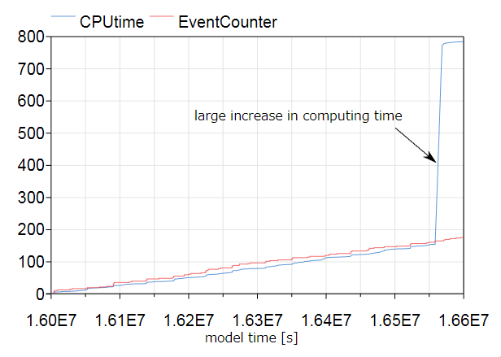  
図2.11 計算時間とイベントの数  
  
状態イベントの数はその時間間隔では増加しませんでした。問題を特定するために、Dymolaの`Simulation->Setup`で、どの状態がエラーを支配するかを記録するオプションを有効にしました（`Debug`タブを参照）。  
再度シミュレーションを実行すると、次の出力が得られました。  
```  
Integration terminated successfully at T = 1.66e+07
  Limit stepsize, Dominate error, Exceeds 10% of error Component (#number)
      0     1     6 cooCoi.temSen_1.T (#  1)
     36     0   140 cooCoi.temSen_2.T (#  2)
     37     0     0 cooCoi.ele[1].mas.T (#  3)
     45     0     0 cooCoi.ele[2].mas.T (#  4)
     51     0     0 cooCoi.ele[3].mas.T (#  5)
     53     0     0 cooCoi.ele[4].mas.T (#  6)
  13555 13201 19064 fanSupHot.filter.x[1] (#  7)
  11905  2170 12394 fanSupHot.filter.x[2] (#  8)
    400    47   419 fanSupCol.filter.x[1] (#  9)
    420    71   521 fanSupCol.filter.x[2] (# 10)
   5082  2736  6732 fanRet.filter.x[1] (# 11)
   1979    25  4974 fanRet.filter.x[2] (# 12)
     38     0     3 TPreHeaCoi.T (# 13)
     30     0     1 TRet.T (# 14)
     38     0     3 TMix.T (# 15)
     80     0     0 TCoiCoo.T (# 16)
    305    22   275 cor.vavHot.filter.x[1] (# 18)
```  
これにより、以下の状態変数がステップサイズを他の変数よりも大幅に制限していることがわかります。  
```  
13555 13201 19064 fanSupHot.filter.x[1] (#  7)
11905  2170 12394 fanSupHot.filter.x[2] (#  8)
  400    47   419 fanSupCol.filter.x[1] (#  9)
  420    71   521 fanSupCol.filter.x[2] (# 10)
 5082  2736  6732 fanRet.filter.x[1] (# 11)
 1979    25  4974 fanRet.filter.x[2] (# 12)
```  
したがって、ファンモデルにおいて`filteredFeed=false`とパラメータを設定してこれらの状態変数を削除しました。この変更後、問題なくこのモデルでシミュレーションをしています。  
  
<a id="chapter2-9"></a>

## 2.9. 数値ソルバー
Dymola 2017は、デフォルトソルバーとして許容誤差1E-4でdasslを使用するように設定されています。この設定を約1E-6程度の許容誤差でradauに変更することを推奨します。これは一般に、熱流体フローシステムのシミュレーションがより速くより堅牢になるためです。  
また、ここでの許容誤差はローカル積分時間ステップの許容誤差であることに注意してください。ほとんどの常微分方程式ソルバーは、ローカル積分誤差のみを制御し、グローバル積分誤差は制御しません。経験則として、グローバル積分誤差はローカル積分誤差より1桁大きくなります。しかし、グローバル積分誤差の実際の大きさは、微分方程式の安定性に依存しています。極端なケースとして、システムが混沌として制御不能な場合、グローバル積分誤差は急速に大きくなります。  
  

<div style="page-break-before:always"></div>  

<a id="chapter3"></a>

# [3. エラーの回避](http://simulationresearch.lbl.gov/modelica/userGuide/workArounds.html)  
この章ではモデルの変換、初期化またはシミュレーション中に問題が発生した場合に役立つエラー防止策について説明します。  
  
<a id="chapter3-1"></a>

## 3.1. ステップ変動の回避  
すべての流体搬送機器（ファンおよびポンプ）はbooleanパラメータ`filteredFeed`を持っており、すべてのアクチュエータはbooleanパラメータ`filteredOpening`を持っています。デフォルト設定である`true`に設定されている場合、制御入力信号はステップ信号を滑らかな信号に変換する[二次ローパスフィルタ](#chapter7)に送られます。これにより通常はシミュレーションの堅牢性が向上します。  
フィルタの効果を確認するには、`fanS`を`filteredSpeed=false`、`fanC`を`filteredSpeed=true`と設定した以下のモデルを検討してみてください。どちらのファンもステップ入力信号に接続されています。`fanS`の設定により瞬時にファン速度が0から1に変化します。大きなシステムモデルではこれは高い計算負荷や収束問題につながります。 `fanC`はファン速度が連続的に変化することでソルバーが解を簡単に計算できるため、この問題を回避できます。このモデルではパラメータ`raiseTime=30`(秒)に設定しています。  
  
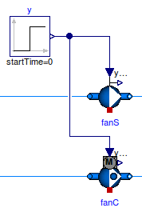  
図 3.1 `filteredSpeed=false`（`fanS`）および`filteredSpeed=true`(`fanC`)と設定したファンの概略図  
  
  
図 3.2 0秒のときにステップ信号を入力したときの2つのファンの質量流量  
 
ファンやポンプの場合、フィルタによるダイナミクスは、ファンロータの回転慣性とダクトや配管ネットワーク内の流体の慣性を近似するものとして考えることができます。デフォルト値は`raiseTime=30`(秒)です。  
アクチュエータの場合、バルブの動作時間として近似します。デフォルト値は`raiseTime=120`(秒)です。  
  
|注意|
|:--|
|`filteredSpeed`（または`filteredOpening`）を変更する場合や`raiseTime`の値を変更する場合は,、閉ループ制御の動的応答が変更されます。したがって、十分な閉ループ制御性能を確保するためにはコントロールゲインを再調整する必要があります。 |
  
詳細は[流体搬送機器パッケージのユーザーガイド](http://simulationresearch.lbl.gov/modelica/releases/latest/help/Buildings_Fluid_Movers_UsersGuide.html)および[アクチュエータパッケージのユーザーガイド](http://simulationresearch.lbl.gov/modelica/releases/latest/help/Buildings_Fluid_Actuators_UsersGuide.html)を参照してください。  
  
<a id="chapter3-2"></a>

## 3.2. 数値ループの分離  
流体フローシステムでは、質量流量が分岐したり合流したりする流体ジャンクションにおいて非線形方程式系を結合することになります。このとき、より大きな系の連立方程式を解く必要がありますが、計算時間がより大きくなることが多く、場合によっては収束問題を引き起こす可能性があります。これらの方程式系を分離するには、フロースプリッタやミキサーのモデル([Buildings.Fluid.FixedResistances.PressureDrop](http://simulationresearch.lbl.gov/modelica/releases/latest/help/Buildings_Fluid_FixedResistances.html#Buildings.Fluid.FixedResistances.PressureDrop))またはファンやポンプのモデル( [Buildings.Fluid.Movers.SpeedControlled_y](http://simulationresearch.lbl.gov/modelica/releases/latest/help/Buildings_Fluid_Movers.html#Buildings.Fluid.Movers.SpeedControlled_y)など)においてパラメータ`dynamicBalance`を`true`に設定します。これにより、流体ジャンクションに式のシステムを切り離すことができる制御ボリュームが追加されます。  
  
<a id="chapter3-3"></a>

## 3.3. 直列接続した流動抵抗の非線形方程式の削減  
流体フローシステムでは複数の要素が直列に接続されている場合、個々の要素の流動摩擦による圧力降下の計算が連立非線形方程式系となる可能性があります。小さなモデルでは問題ありませんが、これにより反復解法を使用する際には膨大な計算時間がかかります。特に他の方程式を残差関数の一部とする大きなモデルでは計算時間が長くなります。
例示のために、流動抵抗を`res1`と`res2`としたときに、パラメータ`from_dp`が`true`に設定されている場合には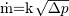<!--\.m=k\ \sqrt[]{\Delta p}-->として質量流量を計算し、そうでなければ入口と出口との間の圧力降下を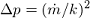<!--\Delta p=(\.m/k)^2-->として計算する下に示すような単純なシステムを考えます。（どちらの式もゼロに近い[正規化](#chapter7)を使用して実装されています）。  
  
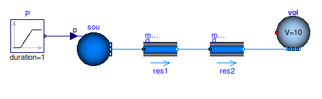  
図3.3 ソースとボリュームを接続する2つの流動抵抗の直列回路図。  
  
個々のコンポーネント個々のモデルの設定によっては、このシステムモデルをシミュレートすると質量流量または圧力降下を計算するために非線形方程式の反復解が必要になる場合があります。  
非線形方程式を回避するには、以下のいずれかの方法を使用します。  
* パラメータ`res2`を`dp_nominal=0`として設定し、かわりに圧力降下をモデル`res1`のパラメータ`dp_nominal`に追加します。これにより、`res2`で流動摩擦を計算する式がなくなり、非線形方程式を回避できます。予熱コイル、加熱コイル、冷却コイルなど、複数のコンポーネントが直列にある場合も同様です。  
* すべてのコンポーネントでデフォルト設定の`from_dp=false`とします。これによりModelicaは圧力損失を質量流量の関数として計算する関数を使用します。したがって、コード変換器は質量流量を解く方程式を生成しやすくなり、それから質量流量を使用して直列に接続された要素の圧力降下を計算します。  
制御弁もまたバルブのモデルへ圧力降下を集中させます。以下に示すように、固定された流動抵抗が制御バルブと直列である状況を考えてみましょう。  
  
  
図3.4 固定された流動抵抗とソースとボリュームを接続する直列のバルブの概略図  
  
パラメータを以下のように仮定します。  
```  
Buildings.Fluid.FixedResistances.PressureDrop res(
redeclare package Medium = Medium,
m_flow_nominal=0.2,
dp_nominal=10000);
Buildings.Fluid.Actuators.Valves.TwoWayLinear val(
redeclare package Medium = Medium,
m_flow_nominal=0.2,
dpValve_nominal=5000);
```  
  
非線形方程式を避けるために、以下に示すように流動抵抗を削除することができます。  
  
  
図3.5　ソースとボリュームを接続するバルブの概略図  
  
もしバルブを以下のように設定している場合  
```  
Buildings.Fluid.Actuators.Valves.TwoWayLinear val(
redeclare package Medium = Medium,
m_flow_nominal=0.2,
dpValve_nominal=5000,
dpFixed_nominal=10000);
```  
バルブは合成した流量係数<!--\={k}-->を次のように計算します。  
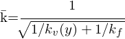<!--\=k=\cfrac{1}{\sqrt[]{1/k_v(y)+1/k_f}}-->  
ここで、<!--k_v(y)=\.m(y)/\sqrt[]{\Delta p}-->はリフト*y*におけるバルブの流量係数であり、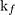<!--k_f--> は`m_flow_nominal/sqrt（dpFixed_nominal）`の比に等しくなります。そして、バルブモデルは<!--\={k}-->と固定抵抗について上述したのと同じ方程式を用いて圧力降下を計算します。したがって、複合モデルは同じ[バルブオーソリティ](#chapter7)と質量流量を持ちますが、非線形方程式は避けることができます。  
  
詳細は[アクチュエータパッケージのユーザーガイド](http://simulationresearch.lbl.gov/modelica/releases/latest/help/Buildings_Fluid_Actuators_UsersGuide.html)を参照してください。  
  
<a id="chapter3-4"></a>

## 3.4. 質量流量を規定するモデル  
一部のシステムモデルでは、理想化されたポンプやファン（[Models.Fluid.Movers.FlowControlled_m_flow](http://simulationresearch.lbl.gov/modelica/releases/latest/help/Buildings_Fluid_Movers.html#Buildings.Fluid.Movers.FlowControlled_m_flow)）または必要な質量流量を出力するソース要素（[Buildings.Fluid.Sources.MassFlowSource_T](http://simulationresearch.lbl.gov/modelica/releases/latest/help/Buildings_Fluid_Sources.html#Buildings.Fluid.Sources.MassFlowSource_T)）を使用して質量流量を規定できます。これらのモデルを使用することで、ファン曲線と流れの抵抗の交点を計算する必要がなくなります。場合によっては、これでより高速でより堅牢なシミュレーションが可能になります。  
  
<a id="chapter3-5"></a>

## 3.5. 過剰な初期化条件指定の回避  
熱流体フローシステムでは、Dymolaはモデルの変換に失敗したときに次のエラーメッセージを出力します。  
```  
Error: The initialization problem is overspecified for variables
of element type Real
The initial equation
...
refers to variables, which are all knowns.
To correct it you can remove this equation.
```  
このメッセージが出力されたときは初期化条件が過剰に指定されています。流体ボリュームを含むモデルの場合は、これを避けるために次のように設定します。
```  
energyDynamics = Modelica.Fluid.Types.Dynamics.DynamicsFreeInitial;
massDynamics = Modelica.Fluid.Types.Dynamics.DynamicsFreeInitial;
```  
[水などの非圧縮性流体の参照圧力の節](#chapter2-4-4)も参照してください。  
<div style="page-break-before:always"></div>  

<a id="chapter4"></a>

# [4. 前処理と後処理](http://simulationresearch.lbl.gov/modelica/userGuide/prePostProcessing.html)  
Modelica言語の仕様ではモデルをシミュレートするためのスクリプト言語は指定されておらず、計算結果ファイルのファイル形式も標準化されていません。モデルのシミュレーションと計算結果の後処理を自動化するスクリプトの提供を目的としてLBNLはPythonのライブラリである[BuildingsPy](http://simulationresearch.lbl.gov/modelica/buildingspy/)を作成しました。このライブラリは以下の目的に使用できます。  
* Dymolaを使用したModelicaシミュレーションの実行  
* DymolaまたはOpenModelicaによって生成された出力ファイル(*.mat)の処理  
* ライブラリ開発の際の単体テストの実行  
  
このライブラリの使用方法については、[http://simulationresearch.lbl.gov/modelica/buildingspy/](http://simulationresearch.lbl.gov/modelica/buildingspy/)の個別の文書を参照してください。  
さらに、Dymolaは、Dymolaで生成した出力ファイル(*.mat)を処理するMATLABスクリプトも提供しています。このスクリプトの使用方法については、Dymolaのドキュメントを参照してください。  
Dymolaによって計算されるコスト関数を最適化するために、最適化プログラム[GenOpt](http://simulationresearch.lbl.gov/GO/)を使用することができます。最適制御問題のコスト関数の計算にDymolaを使用した例については、GenOptのディレクトリexample/dymolaを参照してください。  
<div style="page-break-before:always"></div>  

<a id="chapter5"></a>

# [5. 開発](http://simulationresearch.lbl.gov/modelica/userGuide/development.html)  
この章ではBuildingsライブラリの開発について説明します。  

<a id="chapter5-1"></a>

## 5.1. 開発への貢献  
新しいモデルの提供やライブラリの改善方法の提案は大歓迎です。提供されたモデルは、ライブラリに統合してユーザーがアクセス可能にし、さらにそれらを維持するために必要となるため、次のガイドラインに準拠する必要があります。  
* 他のユーザーにとって一般的な関心があり、十分に文書化やテストが行われている。  
* 次のコーディング規則に従っている。<br>・[the Buildings library user guide](http://simulationresearch.lbl.gov/modelica/releases/latest/help/Buildings_UsersGuide.html#Buildings.UsersGuide.Conventions)<br>・[the Modelica Standard Library user guide](http://simulationresearch.lbl.gov/modelica/releases/msl/3.2/help/Modelica_UsersGuide_Conventions.html#Modelica.UsersGuide.Conventions)<br>・[the Buildings library style guide](https://github.com/lbl-srg/modelica-buildings/wiki/Style-Guide)  
* [the Modelica license](http://simulationresearch.lbl.gov/modelica/releases/latest/help/Buildings_UsersGuide.html#Buildings.UsersGuide.License)の下で利用できる。  
* 流体フローコンポーネントのモデルの場合は、このパッケージの[ユーザーガイド](http://simulationresearch.lbl.gov/modelica/releases/latest/help/Buildings_Fluid_Interfaces_UsersGuide.html#Buildings.Fluid.Interfaces.UsersGuide) で説明している[Buildings.Fluid.Interfaces](http://simulationresearch.lbl.gov/modelica/releases/latest/help/Buildings_Fluid_Interfaces.html)の基底クラスに基づいている。（そうでないと実装が数値的に頑強であることの保証が困難になります。）  
  
ライブラリ開発のウェブサイトは[https://github.com/lbl-srg/modelica-buildings](https://github.com/lbl-srg/modelica-buildings)です。  
  
<a id="chapter5-2"></a>

## 5.2. 新規クラスの追加  
モデルや関数などの新しいクラスを追加する最も簡単で一般的な方法は、既存のクラスの拡張やコピーや変更を行うことです。多くの場合、よく似たコンポーネントが既に存在します。このような状況では、そのようなコンポーネントをコピーして変更することをお勧めします。両方のコンポーネントで類似したコードを共有する量があまりに多い場合には、共通コードを実装する基底クラスを導入する必要があります。[Buildings.Fluid.Sensors.BaseClasses.PartialAbsoluteSensor](http://simulationresearch.lbl.gov/modelica/releases/latest/help/Buildings_Fluid_Sensors_BaseClasses.html#Buildings.Fluid.Sensors.BaseClasses.PartialAbsoluteSensor)を例として参照してください。 このモデルはパッケージ内に1つの流体ポート[Buildings.Fluid.Sensors](http://simulationresearch.lbl.gov/modelica/releases/latest/help/Buildings_Fluid_Sensors.html#Buildings.Fluid.Sensors)を持つすべてのセンサで共有されています。  
  
次の節では、熱流体フロー装置の実装と圧力降下モデルに特有な手引きを示します。  
  
<a id="chapter5-2-1"></a>

### 5.2.1. 熱流体フロー装置  
熱流体フロー装置の構成要素を追加するには[Buildings.Fluid.Interface](http://simulationresearch.lbl.gov/modelica/releases/latest/help/Buildings_Fluid_Interfaces.html) パッケージにある拡張可能な基底クラスを使用します。 これらのクラスの説明については、[Buildings.Fluid.Interface.UsersGuide](http://simulationresearch.lbl.gov/modelica/releases/latest/help/Buildings_Fluid_Interfaces_UsersGuide.html#Buildings.Fluid.Interfaces.UsersGuide)を参照してください。
あるいは、以下のモデルのような単純なモデルを、熱流体フロー装置用の新しいモデルを実装するための元のモデルとして使用することができます。  
  
|||
|:--|:--|
|[Buildings.Fluid.HeatExchangers.HeaterCooler_u](http://simulationresearch.lbl.gov/modelica/releases/latest/help/Buildings_Fluid_HeatExchangers.html#Buildings.Fluid.HeatExchangers.HeaterCooler_u)|流体の流れに熱を加える装置|
|[Buildings.Fluid.MassExchangers.Humidifier_u](http://simulationresearch.lbl.gov/modelica/releases/latest/help/Buildings_Fluid_MassExchangers.html#Buildings.Fluid.MassExchangers.Humidifier_u)|流体の流れに湿度を加える装置|
|[Buildings.Fluid.Chillers.Carnot_y](http://simulationresearch.lbl.gov/modelica/releases/latest/help/Buildings_Fluid_Chillers.html#Buildings.Fluid.Chillers.Carnot_y)|2つの流体の間で熱を交換する装置|
|[Buildings.Fluid.MassExchangers.ConstantEffectiveness](http://simulationresearch.lbl.gov/modelica/releases/latest/help/Buildings_Fluid_MassExchangers.html#Buildings.Fluid.MassExchangers.ConstantEffectiveness) |2つの流体の間で熱と湿気を交換する装置|  
  
<a id="chapter5-2-2"></a>

### 5.2.2. 圧力降下  
圧力降下の式を実装するときは、基底クラス[Buildings.Fluid.BaseClasses.PartialResistance](http://simulationresearch.lbl.gov/modelica/releases/latest/help/Buildings_Fluid_BaseClasses.html#Buildings.Fluid.BaseClasses.PartialResistance). を拡張することをお勧めします。このようなモデルでは[Buildings.Fluid.BaseClasses.FlowModels.basicFlowFunction_dp](http://simulationresearch.lbl.gov/modelica/releases/latest/help/Buildings_Fluid_BaseClasses_FlowModels.html#Buildings.Fluid.BaseClasses.FlowModels.basicFlowFunction_dp)や[ Buildings.Fluid.BaseClasses.FlowModels.basicFlowFunction_m_flow](http://simulationresearch.lbl.gov/modelica/releases/latest/help/Buildings_Fluid_BaseClasses_FlowModels.html#Buildings.Fluid.BaseClasses.FlowModels.basicFlowFunction_m_flow)で実装されているように、ゼロ近傍で正則化された2次関数として流れの抵抗を計算できるようにするべきです。支配方程式は次のようになります。  
<!-- k = \cfrac{\.m}{\sqrt[]{\Delta p}} -->   
ニュートン法ベースのソルバーが動かなくなる可能性があるため、ゼロ近傍での正則化を使用することで極限<!--d\.m/d\Delta p-->が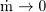<!--\.m \to 0-->のときに無限大になる傾向を回避しています。流れの抵抗が固定値の場合は通常*k*は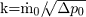<!--k=\.m_0/\sqrt[]{\Delta p_0}-->のような公称条件に基づいて計算されます。ここで<!--\.m_0-->はパラメータ`m_flow_nominal`に等しく、<!--\Delta p_0-->はパラメータ `dp_nominal`に等しくなっています。  
  
すべての圧力降下モデルは、線形モデルの形式で方程式を置き換えることができるパラメータも提供する必要があります。  
  
<!-- \.m\.m_0=\bar{k}^2 \Delta p -->  
  
|注意|
|:--|
|圧力降下の式は体積流量ではなく質量流量の関数として実装されています。いくつかのモデルでは、このことにより質量バランスとエネルギーバランスを切り離すことができます。もしそうしていなければ、質量流量の分布を計算するには温度に依存する密度に関する知識が必要になります。しかも温度はエネルギーバランスを解いた後でのみ分かるのです。|  
  
圧力低下モデルを実装する際には,以下の項目の設定方法を実装してください。  
1. ホモトピーの使用（ホモトピーはデフォルトで使用している必要があります）  
2. 圧力低下モデルの無効化  
  
例えば、圧力降下モデルを無効にすることによって、は加熱コイルの圧力降下がゼロになるように加熱コイルと冷却コイルの直列接続を設定し、加熱コイルの圧力降下を圧力冷却コイルの圧力降下モデルに加えてまとめることができます。多くの場合これにより非線形方程式系のサイズを減少させることができます。  
<div style="page-break-before:always"></div>  

<a id="chapter6"></a>

# [6. ヘルプ](http://simulationresearch.lbl.gov/modelica/userGuide/help.html)  
## バグレポートを提出する前の確認事項  
* バグが既知のものではないか
[https://github.com/lbl-srg/modelica-buildings/issues](https://github.com/lbl-srg/modelica-buildings/issues)を確認してください。  
* モデリングやシミュレーションの環境ではなくモデル自体のバグであることを確認してください。  
  
## バグレポートの提出の際に記載する情報  
* エラーを再現できるもので、なるべく小さい全体のモデル。  
（バグが小さなテストモデルの一部であればバグを早く見つけて修正できる可能性が高くなります。さらに小さなテストモデルを作成することで、バグの根本原因を自分で見つけたり、バグが全くないことを認識することにつながるかもしれません。したがって、問題を早く解決することができます。Dymolaでは全体のモデルは「selecting File -> Save Total」から保存できます。）  
* 想定していた結果と、実際に発生した結果の内容。  
* オペレーティングシステムと使用したModelicaシミュレーション環境に関する情報。  
  
バグを報告するには、 [https://github.com/lbl-srg/modelica-buildings/issues](https://github.com/lbl-srg/modelica-buildings/issues)に新しいIssuesを作成してください。  
  
Buildingsライブラリに関する一般的な質問には [https://unmethours.com/questions/](https://unmethours.com/questions/)を使用してください。これはオープンなグループであり、誰もが参加することができます。招待は必要ありません。
    
BuildingsライブラリではなくModelica自体に関する質問をする際には [https://stackoverflow.com/search?q=modelica](https://stackoverflow.com/search?q=modelica)を参照してください。  
<div style="page-break-before:always"></div>  

<a id="chapter7"></a>

# [7. 用語集](http://simulationresearch.lbl.gov/modelica/userGuide/glossary.html)  
## 二次ローパスフィルタ second order low pass filter  
    2次のローパスフィルタは、以下の式を入出力するブロックです。  
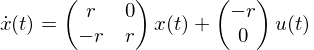<!-- \begin{equation}\dot{x}(t)=\begin{pmatrix}r&0\\-r&r\\\end{pmatrix}x(t)+\begin{pmatrix}-r\\0\\\end{pmatrix}u(t)\end{equation} -->  
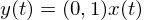<!-- \begin{equation}y(t)=(0,1)x(t)\end{equation} -->  
  
    ここでrは正の実数です。  
    2次のローパスフィルタにより、入力信号u(⋅)は時間で微分可能な出力信号y(⋅)に変換されます。フィルタリングされたステップ応答のプロット図は 3.エラーの回避 のFig.3.2を参照してください。  
## 圧縮性流れ compressible flow  
    非圧縮性流れの反対語です。  
## 非圧縮性流れ incompressible flow  
    流体力学の非圧縮性流れとは、流体と共に移動する流体体積内において、質量密度が一定である流れのことを言います。  
## 反復ソルバー iterative solver  
    反復ソルバーは近似解が収束条件を満たすまで計算を繰り返す数値ソルバーです。例として、非線形方程式系のニュートン法ソルバーと適応タイムステップサイズの常微分方程式ソルバーがあげられます。  
## 数値ノイズ numerical noise  
    数値解における数値ノイズとは、一般的に変数の大きさがソルバーの許容誤差よりも小さいときに発生する、速いけれども小さい変化のことを指します。  
<div style="page-break-before:always"></div>  

## 正則化 regularization  
    正則化とは、微分可能で連続的かつ有界な導関数、すなわち連続的に微分可能な関数によって微分不可能な関数を近似することを意味しています。連続微分可能性は、ニュートン法ベースのソルバーが非線形方程式を解くために必要な条件です。  
## 状態変数 state variables  
    状態変数は時間変化率が微分方程式によって定義される変数です。  
## 熱流体システム thermo-fluid system  
    熱流体システムは中を流れる媒体に熱が加えられる熱交換器のような、物体とエネルギーの複合的な流れを計算するシステムです。  
## バルブオーソリティ valve authority  
    制御バルブの場合、バルブオーソリティNは次のように定義されます。  
<!-- \begin{equation}N=\frac{\Delta p_{v}(1)}{\Delta p_{v}(1)+\Delta p_0}\end{equation} -->  
  
    この式の分子は全開時のバルブの圧力降下であり、分母はバルブが制御する系統全体での圧力降下です。バルブオーソリティNは0.5程度でかつそれを越えないようにバルブを設計するべきです。
<div style="page-break-before:always"></div>  

<a id="chapter8"></a>

# [8. 謝辞](http://simulationresearch.lbl.gov/modelica/userGuide/acknowledgments.html)  
この文書は以下の方々の支援により開発されました。  
* the Assistant Secretary for Energy Efficiency and Renewable Energy, Office of Building Technologies of the U.S. Department of Energy (contract No DE-AC02-05CH11231)  
* the California Energy Commission, Public Interest Energy Research Program, Buildings End Use Energy Efficiency Program (award number 500-10-052)  
<div style="page-break-before:always"></div>  

<a id="chapter9"></a>

# 9. [免責事項](http://simulationresearch.lbl.gov/modelica/userGuide/disclaimer.html)  
注：ここでは重要な内容を扱うため、免責事項の翻訳に関してはあくまで参考程度としてください。翻訳ミスがあった場合でも原文の内容に従います。  
  
この文書は米国政府が支援する業務の報告として作成されました。 本書には正確な情報を掲載していると考えられますが、米国政府やその代理、カリフォルニア大学の評議員およびその従業員のいずれも、明示的または黙示的な保証をせず、すべての情報、装置、製品、公開されたプロセスの正確さ、完全性、有用性について法的責任を負わず、その使用が私的所有権を侵害しないことを表明するものではありません。ここで商品名、商標、製造者に言及することなどにより特定の商用製品、プロセス、サービスを参照していることは、必ずしも米国政府やその代理、カリフォルニア大学の評議員による推奨や推薦または支持を示唆するものではありません。本書に記載されている著者の見解および意見は、必ずしも米国政府やその代理、カリフォルニア大学の評議員のものを表明または反映するものではありません。
  
この文書はカリフォルニアエネルギー委員会の支援の結果として作成されました。ただし、必ずしもエネルギー委員会やその従業員またはカリフォルニア州の見解を示すものではありません。エネルギー委員会とカリフォルニア州、その従業員と請負業者および下請け業者は、明示的または黙示的にいかなる保証も行わず、本報告書の情報に対する法的責任を負わないものし、この情報の使用が私的所有権を侵害しないとは表明しておりません。この文書は、カリフォルニアエネルギー委員会によって承認とも不承認ともなっておらず、カリフォルニアエネルギー委員会が本報告書の情報の正確性または妥当性について合格としたものではありません。  
<div style="page-break-before:always"></div>  

<a id="chapter10"></a>

# [10. 著作権とライセンス](http://simulationresearch.lbl.gov/modelica/userGuide/legal.html)  
注：ここでは重要な内容を扱うため、ライセンスの翻訳に関してはあくまで参考程度としてください。翻訳ミスがあった場合でも原文の内容に従います。  
  
Copyright (c) 2012-2018, The Regents of the University of California, Department of Energy contract-operators of the Lawrence Berkeley National Laboratory. All rights reserved.  
  
1.ソースおよびバイナリ形式での再配布および使用は、以下の条件が満たされていれば、変更の有無にかかわらず許可されます。  
```    
（1）ソースコードを再配布する際には、著作権表示、この条件の一覧、および以下の免責事項が含まれていなければなりません。
  
（2）バイナリ形式の再配布の際には、配布物に付属するドキュメントおよび/またはその他の資料に、著作権表示、この条件の一覧および以下の免責事項を掲載しなければなりません。
  
（3）特定の事前の書面による許可なしに、このソフトウェアから派生した製品の推奨または宣伝を目的として、カリフォルニア大学、ローレンスバークレー国立研究所、米国エネルギー省、または開発貢献者の名前を使用することはできません。
```  
  
2.本ソフトウェアは、著作権者および開発貢献者によって「現状のまま」で提供されており、黙示の商品適格性および特定目的適合性の保証などの、明示または黙示の一切の保証は免責されています。著作権者または開発貢献者は、（代替品や代替サービスの調達、利用機会やデータや利益の損失、業務の中断などの）直接的、間接的、偶発的、特別的、例示的、必然的損害に対して、たとえこのような損害の可能性について知らされていたとしても、本ソフトウェアをどのように使用した結果のものであっても、損害の原因が何であれ、そして法的責任の根拠が何であれ、契約、厳格責任、または不法行為（過失またはその他を含む）のいずれであっても、いかなる責任も負いません。  
  
3.ソースコードの機能、性能またはパフォーマンスに対してバグの修正、パッチ、またはアップグレード（以上をまとめて「機能拡張」とする。）を誰かに提供する義務はあなたには一切ありません。ただし、機能拡張を公的に、または直接ローレンスバークレー国立研究所に提供することを選択する場合には、その機能拡張のために別途書面によって使用許諾契約を締結することなく、あなたに以下のライセンスを付与します。  
バイナリおよびソースコード形式での、派生著作物のインストール、使用、変更、用意、他のコンピュータソフトウェアへの組み込み、配布、そのような機能拡張または派生著作物の再許諾を行う非独占的でロイヤリティフリーな永久ライセンス。  
  
注：このライセンスは、「修正BSD」または「三条項BSD」ライセンスに対応し、「第3項がカリフォルニア大学により追加された」という変更を含みます。  